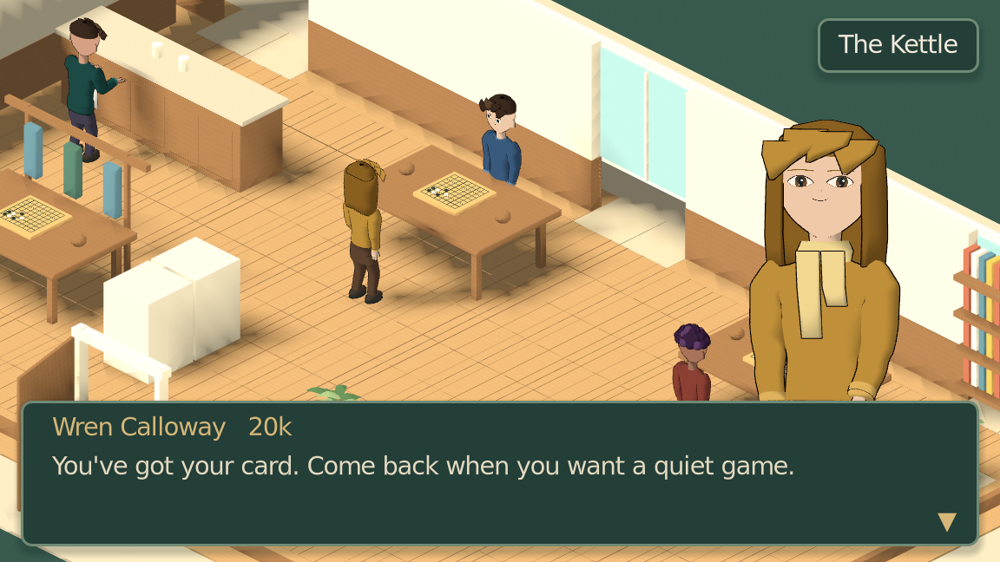
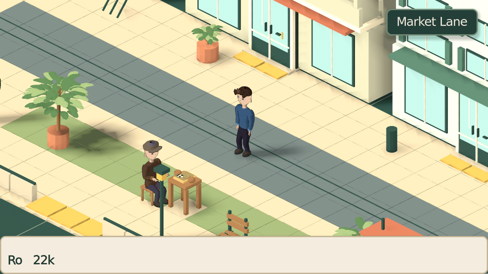
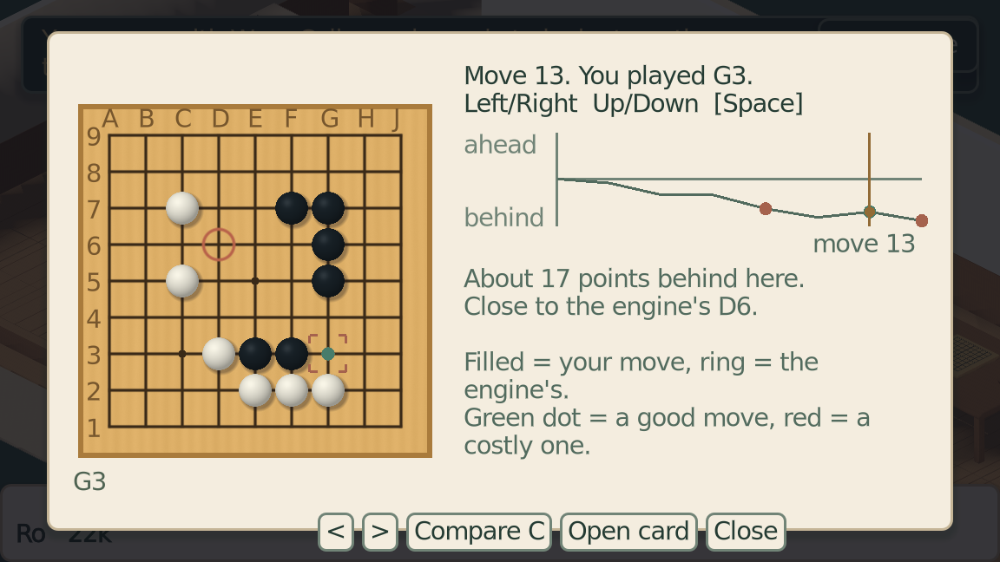

# Ninepoint

**Learn Go by living in a little Go-club RPG.**

   

Ninepoint is a single-player 2.5D RPG about learning **Go**, the board game also known as
**baduk** or **weiqi**, where two players place stones to surround territory. Walk around
a coastal neighborhood, meet the local club, learn over small boards, and enter your
first tournament. **Every encounter is a game of Go. There is no combat, XP, or character
stat that makes your stones stronger. You are the one who gets better.**



*The campaign: meet people, sit down at their boards, and come back for another game.*

[Run it](#run-it) · [Screenshots](#screenshots) · [Player guide](docs/PLAYING.md) · [Practice guide](docs/practice/README.md) · [Development](docs/DEVELOPMENT.md)

## Two ways to play

**New to Go? Start a New Game.** You have just moved to Sela, a fictional coastal city
of shaded streets, balconies and little tables outside shops. The previous tenant left
a board and a bowl of stones in your room. You have no idea what to do with them.
Pip offers your first capture, Wren helps you through the rules, and a tram ride takes
you to fellow beginners at the club. Play the Novice League and work toward the
Beginner Cup. Finishing the Cup is the beginner ending, even if you lose every round.

**Just want a board? Choose Practice.** Skip the story and set up a game against an AI.
Choose a 7×7, 9×9, 13×13 or 19×19 board, opponent rank and style, colour and handicap.
Play normally, turn on teaching with hints and undo, or try first-capture practice.
Lessons, puzzles, saved replays, engine reviews and SGF game-file export are available
without campaign progress. Practice has its own saves, including one unfinished game.

What ties them together:

- **Learn by playing.** Short interactive lessons cover captures, liberties, living groups,
  finishing and counting. The campaign starts from zero knowledge; experienced players can skip teaching.
- **People to play again.** Each club member has a name, a Go rank and a record against you.
  After a game, they react to the result and can review it with you.
- **See what happened.** Walk through a graph of your game, revisit a good move and up to
  two costly positions, and compare your move with the engine's suggestion.
- **Progress at your own pace.** Rank records results. No character upgrades, daily clock
  or relationship meter; the next game waits until you are ready.

## Screenshots

Actual in-game captures. Campaign and standalone Practice currently use different character
presentations; the images below identify which mode you are seeing. Click an image to view it full size.

| Explore the neighborhood · Campaign | Choose your game · Practice |
|:---:|:---:|
| [](docs/screenshots/market-lane.png) | [](docs/practice/screenshots/setup.png) |
| **Count a finished game · Practice** | **Review your moves · Campaign** |
| [](docs/practice/screenshots/counting.png) | [](docs/practice/screenshots/campaign_review.png) |

## Run it

**Playable, in development.** There is no packaged release yet; run the project from source.
The current development and engine setup is tested on Linux. Windows and macOS setup
have not been verified. Beginner AI settings from 30k to 21k are approximate targets
and still need independent human playtesting.

You need **Godot 4.7**. Art and audio are checked in; you do not need Blender to play.

1. Clone the repository:

   ```bash
   git clone https://github.com/jmilne22/ninepoint.git
   cd ninepoint
   ```

2. Import `project.godot` in Godot, let the asset import finish, then press **F5** to run the whole project.
3. Choose **New Game** for the story or **Practice** for a standalone board.

On Linux with Bash, you can also launch from the repository root:

```bash
GODOT="$(command -v godot)" tools/play.sh
```

Use your Godot executable's absolute path if it has another name. The launcher refreshes
imports before opening the game and preserves existing saves. For NixOS, see the
[development setup](docs/DEVELOPMENT.md#nixos).

### Add KataGo opponents and reviews

On **Linux x86_64 with an AVX2-capable CPU**, install the pinned engine and models:

```bash
tools/setup_katago.sh
```

The installer needs Python 3, curl and sha256sum, and downloads roughly 400 MB.
KataGo supplies human-style opponents and game analysis. Budget about 1 GB of RAM
for an opponent engine; optional live teaching runs an additional analysis process.
Without KataGo you can still play using the built-in opponent, but it cannot represent
the selected AI rank, and engine reviews are unavailable. Capture Go needs no engine.

### Essential controls

| Where | Controls |
|---|---|
| Walking around | WASD / arrows to walk, Shift to run, Space to talk or interact |
| Dialogue | Up / Down to choose, Space to advance |
| Campaign menu | Tab to save or return to title |
| At the board | Click to place, or arrows then Space; P to pass; R to offer resignation |
| Teaching Practice | H for help, I for a hint, U to undo |
| Counting | Click a group to mark it dead or alive; P to accept the count |
| Leaving Practice | Esc to save and return, discard the game, or keep playing |

See the [player guide](docs/PLAYING.md) for saves, reviews, lessons and full keyboard controls.

## Follow or contribute

Bug reports and beginner playtest feedback are welcome in [GitHub Issues](https://github.com/jmilne22/ninepoint/issues).
Tell us what you were trying to do, what happened, and your OS and Godot version;
a screenshot or saved game helps. If you tried the teaching, include how much Go you knew beforehand.

For code or content work, start with the [development guide](docs/DEVELOPMENT.md)
and [repository instructions](AGENTS.md).

| Read more | What you will find |
|---|---|
| [Game design](GAME_DESIGN.md) | The world, cast and design rules |
| [Architecture](ARCHITECTURE.md) | Pure Go rules, the RPG, AI and UI boundaries |
| [Art direction](ART_DIRECTION.md) | The visual style and asset pipeline |
| [Workboard](WORKBOARD.md) · [Roadmap](ROADMAP.md) | Current work and future direction |
| [Milestones](MILESTONES.md) | Development history and verification |
