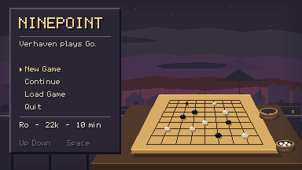
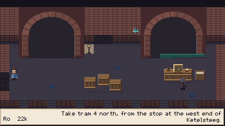
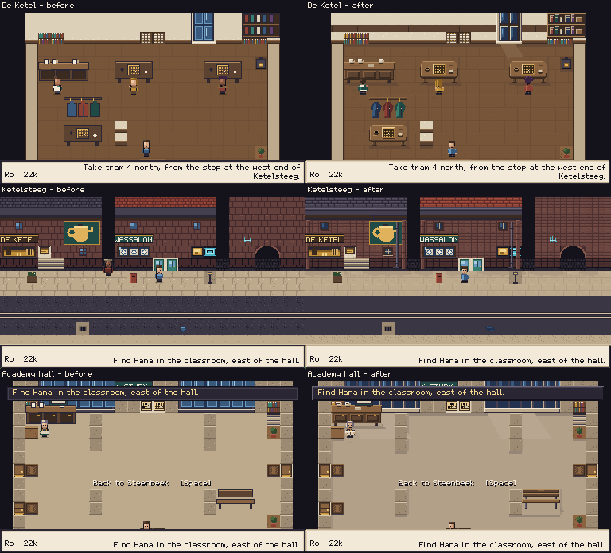

# M47 — Richer same-style art

Verified locally on 2026-09-08, branch `codex/richer-verhaven-art`, based on freshly
fetched `origin/main` / HEAD `c51f085` (PR #27). All art remains authored in Python
with the project's PNG writer. No generated-image service or external art library.

The largest change is form: furniture has tops, front faces and legs; windows sit
inside their walls; arches open into darkness. Material marks support those shapes.
Walking areas remain quiet and the people remain recognizable.

## Owner cleanup — ART-05

The owner flagged fractured diagonal joints on the arch and the title's lamp crossing
its goban. The arch now uses continuous radial mortar joints, aligned piers, restrained
impost courses and centred feet. The title removes the lamp, places a smaller slab on
an actual wooden table and adds separate stone bowls against a muted port skyline.
Menu geometry and portraits remain unchanged.




Verified after a fresh Godot import: ten art tests passed, import had no parse errors,
`art_cleanup` completed with zero script errors, and both images were opened natively
and at 3×. The first replay used cached textures; it was discarded and repeated after
import. This is an art-only follow-up; the full gate below records the preceding M47 pass.
The remaining gallery records that initial pass rather than claiming its title is current.

## Matching benchmark views

Left: investigation captures from the unchanged base. Right: the implemented pass.
Camera positions match; ambient NPC movement and HUD text can differ between runs.



[Integer 2× version](before-after-2x.png). Original captures are in `before/`;
the corresponding final captures are in `screenshots/`.

De Ketel now has worn wooden table surfaces, cups with handles, sleeves on the coat
rack, uneven books and recessed glass. Ketelsteeg uses projecting sills, downpipes,
roof depth and calmer paving/asphalt. The Academy retains its broad open floor and
adds restrained concrete variation, steel furniture, wall trim and window light.

## All twelve maps

The `art_tour` route visits every map, then walks the novice aisle and park and
captures a side-facing walk. All 18 final screenshots were opened in contact sheets
at integer enlargement; all twelve rooms were also opened individually at native size.

| Map | Capture | Visual check |
|---|---|---|
| Wassalon | [Room](screenshots/01_wassalon_from_street.png), [later drum frame](screenshots/02_washer_second_frame.png) | Enamel machine bank, folded cloth, stationary shell |
| De Ketel | [Club](screenshots/03_de_ketel_from_street.png) | Table volume, cups, warm wood, contact shadows |
| Attic | [Desk](screenshots/04_attic_desk.png), [side view](screenshots/17_walk_side.png) | Roof beams, skylight, bed folds, papers |
| Onderbrug | [Arches](screenshots/05_onderbrug_from_street.png) | Deep openings, real crate board, stored cargo |
| Quay | [Water and bench](screenshots/06_quay_bench.png) | Quiet water between ripple groups, empty public space |
| Academy hall | [Hall](screenshots/07_academy_hall_from_tram.png) | Open routes, window recesses, desk and bench |
| Academy study | [Study](screenshots/08_academy_study_middle.png) | Pale tables, study notes and warm smaller desk |
| Academy class | [Class](screenshots/09_academy_class_from_hall.png) | Desk legs, books/pencils, readable demonstration board |
| Academy dorm | [Dorm](screenshots/10_academy_dorm_from_hall.png) | Fabric volume and clear exit mat |
| Bondszaal | [Entry](screenshots/11_bondszaal_from_tram.png), [front](screenshots/12_bondszaal_front.png) | Folding table frames, numbered rows, visible aisles |
| Ketelsteeg | [Street](screenshots/13_ketelsteeg_from_wassalon.png), [park](screenshots/16_park_foliage.png) | Façade depth, clear rails, clustered foliage |
| Academy novice | [Entry](screenshots/14_novice_from_hall.png), [aisle](screenshots/15_novice_central_aisle.png) | Postcard, pencil, paper, repair parts and cushion |

The first quay review still looked repetitive. Three compatible canal families now
include quieter stretches. The final pass also distinguishes the federation's
folding frames from the school's simpler steel legs. Those changes were replayed. Native-size review also caught concrete fill left by old
desk tiles in the wooden classroom and dorm. The replacement-floor rule now respects
those two rooms; their floor material and unchanged navigation are checked in the art suite.

## People and motion

All **21 portrait strips** match the original exports byte-for-byte. The test also
regenerates them and compares the complete files, covering every expression.
The font and audio files were separately compared against the base and are unchanged.

All 26 walking and action sets retain 16×24 cells: 48×96 walking sheets and 32×480
activity sheets. Height differences are drawn into anatomy instead of resampling
finished rows. Side-facing heads, arms, hems and working hands were redrawn from
the same identity records as the portraits. The three cast sheets were opened:
[cast 1](cast-1.png), [cast 2](cast-2.png), [cast 3](cast-3.png).

`art_people` played Wren's working pose, far-side furniture sorting and conversation:
[working/seat](screenshots/people-01_wren_far_seat_sorting.png),
[unchanged portrait in dialogue](screenshots/people-03_wren_portrait_and_sprite.png).

Two live washer captures in the initial all-room pass differed on 78 cloth pixels
and zero shell pixels. The art test checks every generated frame against the first
and rejects any changed pixel outside the four drum interiors. The displayed frame
remains 80×26; collision and floor origin remain fixed.

## Title, ceremony and interface

| Played view | What was inspected |
|---|---|
| [Title](screenshots/polish_fixes-01_a_title_no_saves.png), [load menu](screenshots/polish_title-04_title_load_list.png) | Continuous sky, distant working skyline, unchanged menu positions |
| [Cold open](screenshots/polish_fixes-04_d_opening_backdrop.png), [name entry](screenshots/polish_fixes-05_e_opening_name.png) | Fully opaque backdrop, preserved portrait, quiet panel interior |
| [Instituut arrival](screenshots/arrival-academy.png), [Bondszaal arrival](screenshots/arrival-bondszaal.png) | Window depth and civic framing in the existing timed cards |
| [Nigiri](screenshots/mouse_nigiri-01_a_nigiri.png) | Bowl rim/body, stone pile and shaded fist at existing size and timing |
| [7×7](screenshots/mouse_capture-06_b_seven_hover.png), [9×9](screenshots/mouse_nigiri-03_c_opponent_turn.png), [13×13](screenshots/thirteen-06_f_hover_B12.png) | Subtle grain behind clear grid, stones, coordinates and pointer feedback |
| [19×19 overview](screenshots/mouse_nineteen-02_b_overview_hover.png), [zoom](screenshots/mouse_nineteen-03_c_zoom_hover.png) | Same checks in the development-only large board view |
| [Club entrance](screenshots/polish_thresholds-03_de_ketel_door_prompt.png), [laundrette](screenshots/polish_thresholds-07_wassalon_door_prompt.png), [steps](screenshots/polish_thresholds-10_steps_prompt.png) | Door prompts, interaction positions and clear paths |

During title inspection, the original writer's zero-alpha erase semantics exposed
transparent rows from vignette/lamp passes. The title generator now skips those
zero-alpha marks; the portrait canvas behaviour itself is unchanged. An opacity
test protects both full-screen title backgrounds.

## Technical evidence

[Complete final technical-gate output](technical-gate.txt).

- `tools/test.sh`: **16,879 Godot checks passed, 0 failed; 282 files loaded**.
  Predecessor M46: 16,863 checks, 279 loaded files.
- **10 Python art tests passed**: portrait preservation/regeneration, navigation
  hashes, masked drawing, remapping, atlas-order independence, prop exports/geometry,
  washer motion bounds, deterministic isolated environment builds, sprite contracts,
  and presentation opacity/readability constraints.
- All three real KataGo gates passed: process smoke, shared service, and review.
  Review processed 79 positions on 9×9 and 241 on 19×19; the wedged-engine watchdog
  also passed. No engine settings changed.
- `tools/check_lessons.py`: **0 problems**. `git diff --check`: clean.
- A fresh isolated environment export matches all **79 generated files** in the checkout.
  Atlas/resource coordinate sets match exactly: **118 cells**.
- Final routes `polish_title`, `polish_fixes`, `art_tour`, `polish_thresholds`,
  `mouse_nigiri`, `mouse_capture`, `mouse_nineteen`, `thirteen` and `art_arrivals`
  completed with **zero script errors**. Their images, not just exit codes, were inspected.
- The final federation-frame drawing and classroom/dorm floor correction were
  regenerated and replayed, followed by the art tests and complete technical gate.

The 12-map navigation baseline protects map size, solids, spawns, warps, signs and
NPC records. Visual overlays do not enlarge collision. Resource generation follows
the atlas manifest, including all three canal animation families.

## Reproduce and iterate

```bash
python3 tools/build_assets.py --groups environments --output /home/user/.cache/ninepoint-preview
python3 tools/art_contact_sheet.py --root /home/user/.cache/ninepoint-preview --output /home/user/.cache/ninepoint-props.png
python3 tools/build_assets.py --groups sprites
python3 tools/build_assets.py --groups presentation
python3 tests/test_art.py
tools/test.sh
tools/run_game.sh tools/autopilot/art_tour.json
tools/run_game.sh tools/autopilot/art_people.json
tools/run_game.sh tools/autopilot/art_arrivals.json
```

No flags still rebuilds every category. `environments` includes maps and floor
dressing; `sprites` excludes portraits. Preview roots mirror the repository layout.
The [prop contact sheet](props.png) puts representative assets on actual floors
beside the player. Gameplay routes must run sequentially, using the harness lock.
Verification here used isolated XDG save/config directories under `/home/user/.cache`.

## Limits

This is a visual and asset-pipeline revision. Portraits, font metrics, audio, dialogue,
teaching order, Go rules, ranks, save schema, board geometry and engine settings are
unchanged. No clock, weather or new progression was introduced. The 19×19 view is
still a development fixture, not a new town encounter.

Contact sheets cover the cast; runtime inspection samples walking, working, dialogue,
drums and furniture overlap. It does not exhaust every pose/occlusion combination.
Independent beginner playtesting and the existing ENG-09 ending issue remain separate.
The review judges stronger volume and material identity, not merely more marked pixels.
