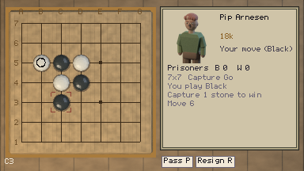
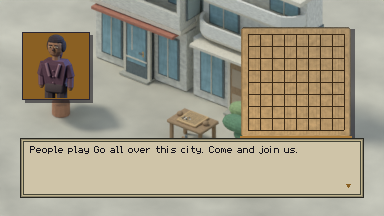

# A believable first game, and a reason to play another

Design investigation, 12 September 2026. Reviewed base: `89e1a35`, equal to freshly
fetched `origin/main` before branching to `codex/design-baseline-audit`.
**Historical audit/proposal at the reviewed base.** The owner subsequently approved
implementation on 12 September 2026. The resulting [capture report](../capture/PLAYTEST.md)
and [baseline report](../baseline/PLAYTEST.md) describe the current candidate. Findings
below describe the old build; proposed acceptance criteria are not measured results.

## Recommendation

Keep Sela, its people, real Go and the local competition. Reframe Ninepoint as:

> You are new to the neighborhood. An invitation to a small Go club gives you a way
> to meet people. Learn enough to enter your first local tournament alongside another
> newcomer; your results are yours, and you have a place here even when you lose.

This is a modest amateur campaign with an explorable neighborhood. Its first promise is
**“I can understand a move, and I want to see these people again.”** It should not promise
beginner-to-professional skill development in one short game.

Your first concern identifies a real design failure, although Pip is not impossible to
beat. Your second identifies the way the game frames and populates its world; it does not
require replacing the coastal setting or building a city simulation.

## What the investigation found

### Pip is beatable, but the encounter does not reliably teach

I played the live, engine-backed encounter and won on ply 7, with four Black placements:
**D4, C5, C3, B4**. Pip replied C4, D5, B5. B4 captured C4. The actual
[SGF](pip-win.sgf) and [result](screenshots/pip-capture-win.png) are retained. His GTP log
confirms the intended `human_18k_fighting.cfg` and real engine replies; there was no
fallback in this game. This disproves literal impossibility, not your experience of difficulty.
It is one informed player's game, not an estimate of beginner win rate.

Four related faults matter more than changing a difficulty number:

1. **The opponent is playing a different objective.** `pip_capture.tres` selects the
   ordinary 18k fighting profile. Its config says `rules = japanese`; `GtpOpponent`
   sends board size, komi, moves and `genmove`, never the first-capture objective.
   A normal-Go move may sacrifice a stone or seek territory. Those choices do not
   reliably model a first-capture opponent. My win included an unanswered capture threat;
   the log cannot establish why the engine chose its reply.
2. **Passing violates the stated lesson.** `GoGame.pass_turn()` enters `SCORING` after
   two passes even when `capture_goal = 1`; `GoMatch` then uses ordinary counting.
   A minimal execution probe reaches “White wins by 0.5” on an empty board with zero
   captures. See [probe output](capture-probe.log). Capture completion tests exercise a
   capture, but never this terminal path. The historical POLISH-02 report even records
   Pip reaching counting; this was classified as a stopping issue instead of a rule mismatch.
   A fresh live route also reproduced it: I supplied passes without placing any Black
   stones, then accepted the count. The screen said **“You lose. White wins by 46.5”**
   with zero prisoners for either side ([capture](screenshots/pip-no-captures-result.png)).
   That is a directly observed contradiction of “capture one stone to win.”
3. **The assistance arrives after the need.** Pip promises to show you on the board,
   then presents two explanatory pages and an empty 7×7. The position-aware Help in
   `MatchTeaching` is enabled for `wren_first`, not Pip. A short objective is not necessarily
   a simple task: chasing a group can require reading escapes and countercaptures.
4. **A completed attempt removes the practice mode.** `match_pip_capture_done` routes
   Pip's next conversation to ordinary 9×9. This applies after a loss too. There is no
   normal Capture Go replay choice. “Thanks for trying; go to Wren” provides access,
   but does not establish that the player understood a capture.

The fallback is not a ready solution: its candidate filter rejects non-capturing
self-atari regardless of `mistake_rate`, and its pass/mercy decisions concern territory.
Lowering a profile's search depth or raising its mistake rate does not remove those rules.

I did not reproduce your exact game or a literal drawn result. “I can only hold it to a
draw” may describe a board where neither side can make a capture. That experience is
consistent with an unguided first-capture fight, but its frequency is unmeasured.

### The city framing is explicit, and the narrative consequence is thin

Hana says “People play Go all over this city.” All twenty named NPCs are opponents;
the activities offered by the explorable venues repeatedly lead to Go. Five institute
rooms and formal registration/exam language amplify the sense of an entire Go society.

There is already useful counterevidence: Tomás runs a bar, Ivo makes deliveries, Emil
repairs lamps, and Abel is visiting for the Cup. The laundry is plausibly somewhere a
visiting player would meet club regulars. The problem is not that these people could
never share a hobby. It is that the player is shown their game menus more strongly than
their connection to a wider world.

The opening also supplies a chain of directions before it supplies an ambition:
note → Pip → Wren → Kesh → Hana → registrar → board. Noor's request for company is a
good personal hook, but it arrives after the substantial teaching/registration approach.
The player's curiosity is assumed throughout.

**Pushback:** concentrating on a hobby community is a legitimate fiction. A football
career game naturally meets many footballers. Sela does not need realistic population
ratios. It needs to explain the selection: these are people connected through a club
and a local event, not representative random citizens whom everyone challenges.

### The existing backbone deserves preservation

- Real rules, honest recorded results, optional practice and the human learning.
- Kesh's card before optional practice. Requiring an even game against her was already
  rejected and fixed in PROG-02; do not rebuild that problem.
- A novice league and Cup ending available despite losses. Optional Academy competition
  can remain later. A loss should affect the result without withdrawing belonging.
- Short physical writing, ordinary activities, the tram and compact walking loop.
- Reaction before optional review; no XP, affection score, economy or schedules required.

I verified the loss-tolerant progression using the maintained scripted route: five novice
resignations, four Cup resignations, a truthful sixth-place completion, then a fresh league
attempt at zero. See the [Cup table](screenshots/cup-complete.png) and
[method](EVIDENCE.md). That is access/record evidence, not evidence that nine losses are fun.

However, “losing advances the quest” is only mechanical forgiveness. It does not make
repeated helpless losses enjoyable. The owner has already reported close-ish wins against
Noor and Ivo; PROG-01 still correctly withholds acceptance of the five target ranks.
CONTENT-05 and ENG-09 remain unresolved questions, not work superseded by another art pass.

## What to take from the Reddit discussion

Use the [2019 discussion](https://www.reddit.com/r/baduk/comments/bngk73/is_there_interest_for_an_rpg_about_go/)
as a design conversation, not audience validation. The author clarifies that the desired
structure is closer to a sports campaign/career than a large story RPG. Commenters identify
two useful requirements: reasonably even games and a story reason to continue when the
human's skill does not grow quickly. Short demonstrated positions and helpful analysis
also fit our teaching needs.

Do not copy the entire feature list. XP gates, money, purchasable assistance, secret
adaptive ranks and fictional promotion to professional status conflict with Ninepoint's
chosen foundation. A cosmetic career can work in another design; here the better promise
is a satisfying first amateur event with truthful results. An experienced-player route
can skip instruction, but this first slice should be designed and tested for newcomers.

The engine's own [pinned Human-SL documentation](https://github.com/lightvector/KataGo/blob/v1.15.0/docs/Analysis_Engine.md#human-sl-analysis-guide)
lists profiles starting at 20k and warns about out-of-distribution rank/handicap pairings.
A profile label is not evidence of a suitable first opponent, especially under a different
win condition. We already have the machinery to separate a teaching encounter from someone's
ordinary playing rank.

## Proposed sequence of work

### 1. Repair the first encounter as one complete teaching slice — CAP-01

**Outcome:** the player makes and understands a capture, then chooses whether to practise
or move on. This is the first implementation priority, before rewriting the whole town.

Recommended format:

1. Pip explicitly offers a demonstration. On a small prepared position, the player
   identifies adjacent empty points and makes one legal capture. Keep the board visible;
   show the captured stone leaving and explain why. Do not frame following this setup as
   beating an 18k opponent in a competitive game.
2. Offer a short Capture Go practice on the existing empty 7×7, and an explicit option to
   go to Wren. Use a dedicated policy that understands first capture. Keep Pip's normal
   rank and 9×9 engine unchanged. Assess a 5×5 alternative only if 7×7 still produces
   long opaque chases; “smaller” alone is not proof of “easier.”
3. Offer Help immediately: select a group, inspect its liberties, then optionally ask
   for a capture/saving example. Escalate on request; do not choose the player's move.
4. After a capture, loss or abandoned practice, offer “Try Capture Go again,” “Show me
   that capture,” and “Where can I learn the full game?” on the relevant return interaction.
   Replaying the final local position explains the result; it does not need territory analysis.

**Rules decision:** first capture is the only victory condition. Recommended two-pass
outcome is “Practice ended; neither player captured,” with retry/continue, no territory
count, komi victory, fabricated win or loss reaction. State this before play. Represent
the neutral end explicitly through results, records and dialogue; preserve existing saved
results rather than rewriting them. This decision also covers a player who simply wants out.

**Implementation boundaries:** keep variant rules/results pure in `src/go/`; place the
practice policy in `src/go_ai/`, explanation/replay in `src/go_ui/`, and offers in Pip's
dialogue. Edit `tools/gen_content.py`, not generated `.tres` files. Check review eligibility
by encounter/rules mode rather than relying solely on `by_capture`: a resigned or pass-ended
Capture Go game should not receive a normal territory review. Audit every terminal path.

**Acceptance:** verify capture wins for both colours, legal/refused attempts, two-pass
neutral ending, resignation/leave, retry, save/load, no rank change, no lost onward access,
and no ordinary-Go review. Include engine-present and engine-unavailable launches. Play
the whole new opening and inspect its screens. A fixed teaching policy must remain legal
under unexpected moves; it must not force an illegal script or silently award a win.

The demonstration is intentional scaffolding, not covert loss-dependent weakening.
Scripted positions are already supported; a perfect Capture Go solver is not required.

### 2. Prototype a believable opening and social connection — DESIGN-01

Build a small narrative slice before changing every conversation or render:

- **Home/Pip:** retain the found board as an invitation to ask a neighbor about it.
  Replace the city-wide claim with a specific club invitation. Make declining/departing
  natural, not a rejection of the campaign. No mysterious destiny is required.
- **The Kettle:** establish one regular club group using Tomás's tables. Wren volunteers
  to get newcomers started; Kesh helps register them because she is part of that group.
  Give each a want beyond a rematch, expressed in a concrete exchange, not biography panels.
- **School:** recommend presenting the existing institute as a neighborhood Go club's
  teaching space in a community centre. Use existing rooms, cast and internal `academy_*`
  IDs. This changes displayed fiction, not geographical layout or save identity. Retaining
  “Sela Go Institute” as a small club name is a lower-cost alternative if its grandeur is
  not a problem in the prototype; no new maps are justified yet.
- **Noor/Cup:** introduce the shared first-tournament ambition before registration becomes
  the player's main task. Reuse Hana's direction to Noor and Noor's existing invitation;
  strengthen their continuity instead of adding another compulsory meeting.
- **Ordinary city:** add two or three brief, optional non-Go interactions using existing
  residents/passer art and venue objects. A person can have a complete exchange without
  a rank, match menu or referral to Wren. Most scenery remains scenery; no shop economy.
- **Return/payoff:** at a league checkpoint and after the Cup, let an existing conversation
  acknowledge something other than the table position: showing up together, facing an
  unfamiliar opponent, finishing the event. Use existing completion facts. The win/loss
  reaction still describes the actual result; no invented emotional score or performance claim.

Write the opening-to-Noor script as a connected scene sequence first, including refusal,
loss and repeat visits. Play that limited version in the existing art. Only after it works
should the voice sheet and remaining venues adopt the baseline. No mass art regeneration
or new city is the first step.

**Acceptance:** a newcomer can say why they are learning, why these people know one another,
why they are going to the class, and what entering the Cup means to them. They can name one
person for a reason other than rank. Test these as open questions, without supplying the answer.

### 3. Validate the first full game and the path to peers

Reuse CONTENT-05, ENG-09 and PROG-01; do not create another competing calibration project.
Observe Wren's supported game followed by Noor/Ivo. Record whether the learner can choose
a move, recognize a threat, make a useful late move and explain passing/counting. Record
long continuations and premature passes separately from strength and incorrect dead marks.

Wren currently puts four rules exercises and four finishing beats before the full game,
with two optional opening comparisons. Preserve the demonstrated ending while testing
whether this is too much before the first independent satisfying game. The recommended
first iteration fixes Pip; it does not pre-emptively rewrite the recently improved Wren track.

If Wren is still a discouraging barrier, propose a separately labelled teaching profile or
an explicit route from the lessons to a novice peer. Measure that experiment. “Unrated”
only protects the record; it is not a difficulty solution. Do not weaken the entire cast or
move honest ranks to make a graph look smoother.

### 4. Test the baseline with people before expanding it

Recruit an initial **5–8 independent newcomers**, including people with no Go knowledge
and people a few games in. This is a formative round, not statistical certification of ranks.
Keep experienced players as a separate skip/return check. Retest revised failures with fresh
participants rather than teaching the same tester the intended answers.

Proposed targets to agree before implementation:

| Question | Evidence to collect / initial target |
|---|---|
| Can they do the first thing? | At least 4 of 5 new players make and explain a capture within five active minutes, with in-game support and no facilitator coaching. |
| Did the idea transfer? | They identify a capture in a different position; success in the guided setup alone does not count. |
| Is practice recoverable? | Every tester can find retry, help and onward travel after a loss or neutral ending. |
| Is the fiction legible? | At least 4 of 5 describe a local group within an ordinary city and give a personal reason to meet the novices. |
| Is a full game manageable? | Save SGF, help usage, passes, final position and the learner's explanation of the result. Investigate each helpless loss or unexplained ending. |
| Do they want another game? | Ask what they would choose to do next and why; record actual voluntary continuation as well as comments. |

These numbers are proposed design thresholds, not measurements or guarantees. Record prior
experience, exact build/config, colours, handicap, active play time, result, interventions
and dropouts. Bot games can check variation, termination and relative strength. They cannot
close motivation, learning or the existing human rank-validation gate.

## Decisions and documents

The recommendation changes the explicit “Pip first, before teaching” order by making his
first encounter an openly guided demonstration, and may change the institute's displayed
identity. Those are proposed owner decisions; they are not silently installed by this audit.
Real Go, the rank ladder, fixed opponent identity, loss-tolerant leagues, cast and save IDs
remain the foundation. No release milestone is appropriate for an investigation.

Before implementation, reconcile GAME_DESIGN §§0–7 and the stale §9 chapter table,
AGENTS' opening/current-state/gaps, README's beginner promise, VOICES, ROADMAP and the
workboard. The chapter table still puts the Beginner Cup on 13×13 at 17k–14k despite the
current 9×9 novice route. ENG-08's old summary still describes Kesh's first rated nigiri
game despite PROG-02. GAME_DESIGN also retains blanket claims about laundry records and
Joos's nine stones contradicted elsewhere. These should not be used to size new work.

Preserve MILESTONES and old play reports as history. Add a dated clarification/link where
a historical claim could mislead; do not rewrite yesterday's evidence as today's acceptance.
Detailed method, coverage and limits are in [EVIDENCE.md](EVIDENCE.md).
