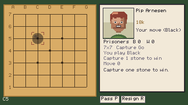
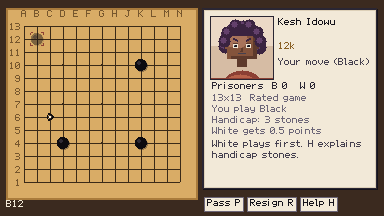
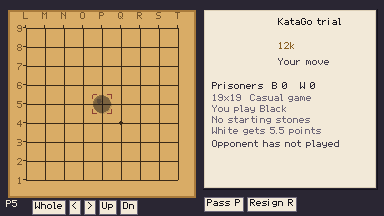
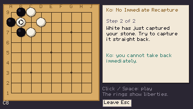
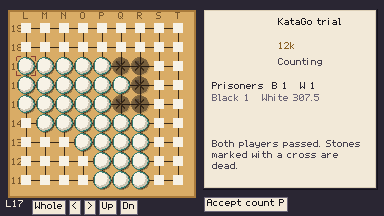
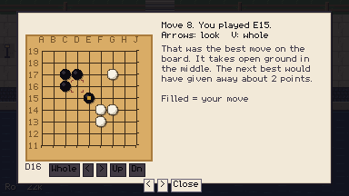
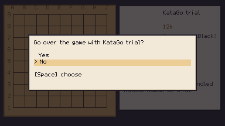

# Board mouse support: observed play

UI-02, based on verified `origin/main` `07b3694`. Gameplay used isolated
`XDG_DATA_HOME=/home/user/.cache/ninepoint-mouse-play`; tests used a separate
`/home/user/.cache/ninepoint-mouse-tests`. The player's saves were not touched.

## What was played

| Route | Observed behavior |
|---|---|
| `mouse_capture` | Fresh opening/world route to Pip; clickable Capture Go reminder, 7×7 preview, placement and reply, resignation/result and world return. The wood now fits beside the opponent panel. |
| `thirteen` | Kesh's real club offer; both handicap explanation pages, 13×13 preview and legal placement, reply, mouse resignation and club return. |
| `mouse_nineteen` | 19×19 controls modal, hover without view/game changes, mouse zoom and pan, real-engine reply, confirmation blocking/cancellation, result, review acceptance and leaving analysis running. |
| `mouse_colours` | The real ceremony component accepts both White and Black through mouse events, independently of random nigiri outcomes. |
| `mouse_nigiri` | Actual nigiri guess, colour choice when won, and 9×9 play at 2× and 3× window scales. Hover during thinking shows no ghost; the same stationary pointer previews a stone when the turn returns. |
| `mouse_count` | A played development game reaches counting. Hover outlines a connected group; two mouse clicks change and restore its dead marks/score. Mouse accepts the count and exits through the result. |
| `mouse_lessons` | Wren's ko lesson: liberty hover, capture, continuation, ordinary preview on the illegal recapture point, existing explanation on click, and lesson completion. A second click during the feedback beat is blocked. |
| `mouse_puzzle` | The attic's One Liberty puzzle: wrong move and rollback, a blocked second click during rollback, reset, solution and clickable continuation. |
| `mouse_review_choice` | In-card Yes/No hover, keyboard selection, No click and world return. Replayed `mouse_nineteen` to click Yes and `thirteen` to click No. Duplicate footer buttons removed. |
| `mouse_review` | Saved 19×19 review: target inspection, zoom/pan, next-page and close buttons. No placement preview or position changes. |

Screenshots were opened, not merely generated. These routes use actual Godot mouse
motion/button events through viewport transforms; ordinary world navigation remains
keyboard-driven. Autoplay supplies the counting fixture's moves; it does not demonstrate
human playing strength. Nigiri's colour-choice branch is random in a full encounter;
`mouse_colours` separately exercises both choices in the real ceremony component.

## Findings and corrections

- No motion handler existed in the shared board view. Hover now uses a separate pointer
  target, with no legality queries or engine analysis.
- Space after mouse exit or zoom must retain the selected point. Pure and played
  handoff checks guard this boundary.
- Cursor-following zoom would move under a mouse target. Its view anchor is now separate;
  explicit pan controls move it while ordinary clicks leave it steady.
- Hover must not refresh away an illegal-click message or table talk. Full match refresh
  now follows view-region changes, not every pointer motion.
- Old `thirteen` stopped at the handicap explanation but claimed a played move. It now
  clicks both pages, waits for readiness, plays and returns to the club.
- Old `lessons` chose a rematch from Wren's current menu. Both lesson routes now explicitly
  choose the ko offer before exercising its illegal attempt.
- Seven-line wood painted into the opponent panel; its larger margin is now reserved.
- The bitmap font has no usable caret glyph; pan buttons use readable Up/Dn labels.
- Engine preparation can outlast a fixed screenshot delay. Button probes wait for the
  visible enabled control rather than assuming a five-second delay means readiness.

## Verification limits

Final `tools/test.sh`: **14,476 passed, zero failures**, **239 files load**, all three
serial KataGo integration gates passed. The 19×19 analysis covered 241/241 positions;
the stalled-engine watchdog also passed. `git diff --check` passed. The original
`nineteen` keyboard route was replayed and its screenshots opened. Existing shutdown
ObjectDB/resource warnings still appear in some routes; this task is not a lifetime audit.
Town dialogue, movement, title and save menus retain their existing keyboard controls.
No rank, result, Go rules, engine profile or save-schema changes were made.

## Representative screens

### Seven lines

### Thirteen lines

### Nineteen lines, close view

### Ko: explanation only after clicking

### Counting

### Review inspection

### Clickable review choices

Follow-up verification: 239 files load and 14,476 checks pass after making the
choice rows themselves clickable. Hover and keyboard screenshots were inspected.
