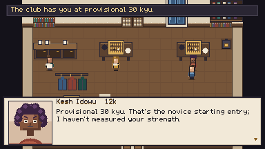
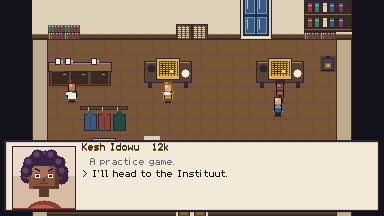
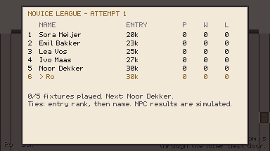
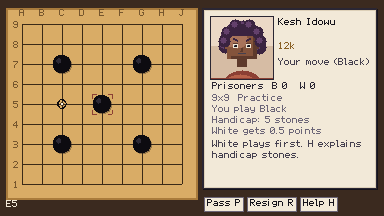
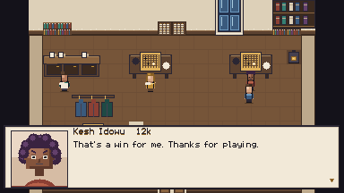

# PROG-02 — Kesh's welcome, 2026-09-06

The owner found the required even game against 12k Kesh followed by an unconditional
30k card confusing and discouraging. The approved replacement gives the provisional
card and Instituut invitation before offering optional, unrated handicap practice.

Kesh keeps her 12k profile. At the novice starting rank, the existing 9×9 handicap cap
provides five stones and 0.5 komi. The game is not a placement assessment. Declining
ends the opening quest without fabricating a result. Actual practice results remain in
history and retain win/loss reactions and reviews; they change neither rank nor rated-win
unlock counts. Old ranks, recorded outcomes and completed quests are preserved.

Wren and the journal now direct the player to ask for a novice card. During inspection,
the rank card was found to leave dialogue consuming its keys underneath. Dialogue now
handles unhandled input so the modal card consumes keys first. The live `rank_card`
probe verifies that dismissal does not also advance the underlying conversation.

## Verification

- `tools/test.sh`: **16,242 passed, 0 failed; 260 files loaded**. All three real KataGo
  gates passed, including full 9×9/19×19 reviews and the stalled-engine check.
- `tools/check_lessons.py`: **0 problems**. Kesh/Wren dialogue read and content validation
  passed. `git diff --check` clean.
- `novice_rank_card`: card before any match; dismissal leaves dialogue unchanged;
  decline, save, reload and return all passed. Existing rank preservation and both
  practice outcomes are covered by the onboarding regression checks.

- `kesh_skip`: full New Game → Pip → Wren's lessons and complete practice → decline
  Kesh → tram → Hana's problem → registration → Two Eyes → novice room passed.
  The save contains only `pip_capture` and `wren_first`, both unrated; no Kesh history
  or match flags. First Stones is complete, rank 30k, next opponent Noor, all six
  standings rows at zero. The corresponding screens were opened and inspected.

- `kesh_practice` after the input fix: a complete 69-move handicap game reached the
  count (loss by 33.5), review offer and Kesh's loss response. The saved result is
  unrated with five handicap stones; the rank remains 30k. Setup, count and response
  screenshots were opened. The earlier 66-move run also completed before the modal fix.
- Successful play routes logged zero script errors. Existing Godot exit resource-leak
  warnings remain; these runs do not claim to fix that separate shutdown issue.

Play runs use separate XDG data directories under `/home/user/.cache/ninepoint-kesh-*`.
The user's actual save slots are untouched. No commit, merge or publication is implied;
the wider novice release still needs the remaining human strength validation.

## Inspected screens

Reproduce with `TIMEOUT=1200 tools/run_game.sh tools/autopilot/kesh_skip.json`,
`TIMEOUT=180 tools/run_game.sh tools/autopilot/novice_rank_card.json`, and
`TIMEOUT=720 tools/run_game.sh tools/autopilot/kesh_practice.json`. Set isolated
`XDG_DATA_HOME`, `OUT` and `LOG` values for each, as in the main playtest report.

