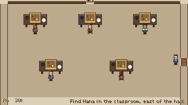
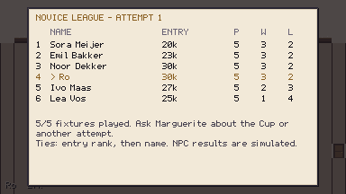
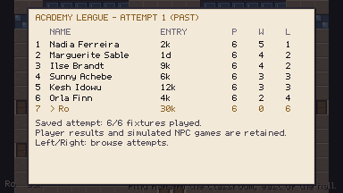
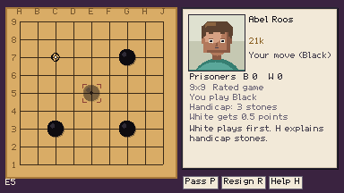
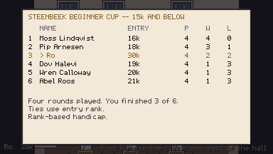
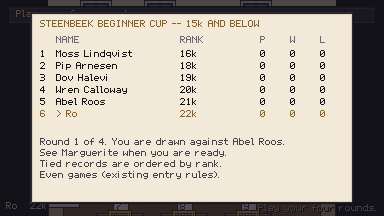
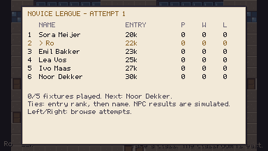
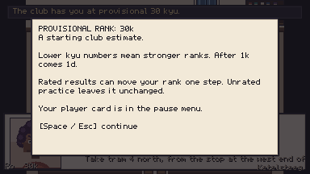

# PROG-01 — novice league implementation candidate

This branch implements the approved beginner-first progression. **Release is blocked on
independent beginner strength validation.** The five ranks are calibration targets;
separate configuration files and bot wins do not certify five human skill levels.

## What changed

Kesh issues provisional 30k. The original PROG-01 build kept all three opening games;
[PROG-02](KESH-WELCOME.md) now gives the card before optional unrated handicap practice. Five novice classmates
share a new room through the Instituut hall's lower west door. Complete their five fixtures
at any placing for the main Cup invitation. New beginner Cups use rank-based handicap;
finishing four rounds supplies the beginner ending. Academy registration and its exam are
optional afterwards. Completed attempts can be retried and remain browsable.

All entrants start at zero games. The saved round robin counts player fixtures by existing
history indices, settles NPC results once per player round, handles Academy byes, and uses
frozen entry ranks for ties. Old leagues import their original baseline and first-fixture
results; old ranks, reviews, completed quests, certificates and entered Cup/exam rules survive.

## Owner playtest feedback — 2026-09-06

The owner beat Noor and Ivo and described each as "close-ish". This supports achievable
opening games for that player. It does not establish their exact ranks, a perceptible step
between them, or the other three classmates' suitability. The owner also rejected the
compulsory even Kesh game followed by a fixed 30k card; PROG-02 addresses that separately.

## Repeatable routes

Run each with a separate `XDG_DATA_HOME`, `OUT`, and `LOG` under `/home/user/.cache`:

```sh
TIMEOUT=3600 tools/run_game.sh tools/autopilot/novice_journey.json
TIMEOUT=1200 tools/run_game.sh tools/autopilot/novice_losses.json
TIMEOUT=1200 tools/run_game.sh tools/autopilot/novice_academy.json
TIMEOUT=1800 tools/run_game.sh tools/autopilot/novice_cup.json
TIMEOUT=600 tools/run_game.sh tools/autopilot/novice_legacy.json
```

- `novice_journey` now declines Kesh after the card. The original recorded PROG-01 run
  below preceded PROG-02: New Game, lessons including self-capture, Wren's complete practice
  game, Kesh's first rated game, 30k card, tram, Hana, enrolment, Two Eyes, five complete
  novice games, four complete Cup games, ending and retry. Kesh's rated game is resigned
  deliberately; the first three setups are unchanged. The player is an automated heuristic,
  so this route is evidence of functioning progression, not human learning or difficulty.
- `novice_losses`: explicit registration fixture, five resignations, four handicap Cup
  resignations, ending and a fresh attempt. This proves losing cannot exhaust the journey.
- `novice_academy`: a completed-Cup fixture, optional Academy entry, all six scheduled
  fixtures with byes, a disk reload after three, a losing retry and archive browsing.
  This focused route uses explicit map visits between venues.

The old fresh route advanced after 0.5 seconds while an accepted illegal move displayed
feedback for 0.6 seconds. The harness now waits for feedback to finish. The new route also
waits for the actual destination map after the tram arrival, and selects changing dialogue
choices by their visible text. These checks do not inject a league win or overwrite a loss.

- `novice_cup`: four complete games after a new Cup registration, exercising frozen
  entry ranks and the explicit handicap policy.
- `novice_legacy`: three declared old saves loaded through the title UI: active exam
  field, an already-entered even-game Cup, then an old Academy table and explicit novice
  enrolment without changing the old rank.

## Engine experiment

```sh
godot --headless --path . --script res://tools/katago_strength_probe.gd -- \
  --cells=novices --games=8 --concurrent=2 --tag=novice-initial
```

Five profiles against the Human-SL 20k reference, plus four adjacent-profile comparisons:
72 complete-game jobs, alternating Black/White within each cell. Configurations and SGFs
are recorded. Move-cap truncations are rejected instead of counted as finished games.
KataGo still decides pass and resignation. The fixed temperatures (early and normal) are
Noor 4.0, Ivo 2.75, Lea 2.0, Emil 1.5, Sora 1.0; all use `preaz_20k`. These settings never
read the player's recent record. Existing cast configurations are unchanged.

### Recorded result, 2026-09-05

[Raw 72-game report and SGFs](strength-initial.json) ·
[Exact configuration contents and checksums](configuration-provenance.json)

All 72 games completed successfully: zero rejected/truncated games, four games as each
colour per cell. Runtime was 2,828 seconds with two workers. Mean engine reply time per
cell was 0.90–1.08 seconds. Wins are from the named subject's perspective:

| Subject (target) | vs Human-SL 20k | vs preceding novice |
|---|---:|---:|
| Noor (30k) | 0/8 | — |
| Ivo (27k) | 0/8 | 7/8 vs Noor |
| Lea (25k) | 2/8 | 7/8 vs Ivo |
| Emil (23k) | 3/8 | 7/8 vs Lea |
| Sora (20k) | 5/8 | 6/8 vs Emil |

This supports different relative playing strengths in this small experiment. It does
**not** establish the exact rank gaps or plausible beginner behaviour. All eight Noor vs
reference games ended in resignation; the tool's printed 0.0 margin is a placeholder for
no scored games, not an even score. The report retains resignation, engine scoring and
local counting separately. Human peer validation remains outstanding.

## Human release gate

Recruit independent beginners at different points in their first games, including people
who have just learned liberties and capture. Record their prior experience, opponent and
configuration revision, colours, handicap, SGF, result, and short notes after complete games.
Use both colours for even games and the actual rank-based handicap for later fixtures.

Ask whether the opponent's moves made sense, whether games felt achievable, and which
positions felt far above or below the tester's ability. A win against random-looking play
is not sufficient; neither is a loss by an automated opponent. Repeat with multiple humans
and games before assigning ranks. Specifically compare adjacent profiles: eight bot games
per pairing are exploratory evidence, not proof of distinct rank bands.

If the five targets are not plausible peers, tune fixed novice settings in
`tools/novice_cast.py`, regenerate, rerun complete engine games and repeat human testing.
Keep content release blocked if plausible strengths cannot be produced. Do not compensate
with difficulty tied to recent wins/losses or by silently weakening existing characters.

## Verification record

- Full New Game route: completed all opening lessons, five complete novice games
  (3 wins, 2 losses), four complete Cup games (1 win, 3 losses), the beginner ending
  and a new attempt at zero. It ended at 29k. All three main quests were complete.
  [Saved route history](journey-save.json) preserves the match/attempt indices. This run
  preceded the subsequent Cup entry-rank fix; the focused Cup rerun verifies that fix.
- Losing route: five novice and four Cup resignations reached the same ending, still at
  30k, and started a new zero-game attempt. Resignations were intentional route inputs.
- Academy route: completed all six fixtures as losses, reloaded after three from disk
  without changing fixtures/history, then retried and browsed the archived attempt.
- The normal compile/load, rules/content and real-engine gates passed. Final numeric
  counts and the remaining focused run results are recorded below.

Opened and inspected the room, provisional card, self-capture feedback, all novice match
setups and result screens, completed standings, Cup handicap boards and ending, Academy
zero/completed/retry/archive boards. The candidate has no independent human strength
acceptance yet.





New Cup entries also save the player's entry rank for the draw. Rated results may change
handicap at the next board, but cannot reconstruct earlier Cup pairings from a different
rank. The Cup retains its existing score-based pairing rule, including an occasional
rematch when the six-player draw cannot pair the remaining players afresh. Legacy active
Cups retain their original policy. This is separate from leagues, where every scheduled
pair appears exactly once per attempt.

Final gate: `tools/test.sh` passed **16,137 checks**, loaded **260 files**, and passed
all three real KataGo gates (smoke, service and review). Both review board sizes and the
stalled-engine watchdog passed. `tools/check_lessons.py` reported **0 problems**.

The focused new Cup rerun completed all four full games at 2 wins and 2 losses, third
place. Its entry rank stayed 30k while the live card ended at 28k; handicap was 3, 4, 3,
and 3 stones. The saved draw retained its earlier pairings. Its existing rematch fallback
remains visible (Abel appeared twice), as intended. [Saved Cup](cup-save.json).




Legacy route: all three declared old saves loaded through the title UI. The active exam
retained its field; the already-entered beginner Cup showed even-game rules and actually
started with zero handicap at 5.5 komi. The old Academy standings retained their simulated
baseline. Explicit novice enrolment then created six zero-game rows while preserving the
player's 22k card and the old attempt. The corresponding images were opened and inspected.




The focused `novice_rank_card` run replayed Kesh's first-game setup and confirmed the
card explicitly calls 30k a provisional starting club estimate. Its text fits the card;
the screenshot was opened and inspected. The final suite rerun remained 16,137/0.



All routes used isolated cache save directories. Existing user saves were not touched.
Normal Godot shutdown resource warnings remain; the successful routes had zero script
errors. No independent human has signed off the target strengths, and PROG-01 is not shipped.
