# Overhaul screenshots

Native captures are 384×216. Selected 3× copies use nearest-neighbour scaling.
These are captures from the running game. Saved-outcome fixtures are identified below.
See [the play observations](PLAYTEST.md) for what was played and what fixtures establish.

## Wassalon

Wassalon: machines, folding counter, approachable table and bench.

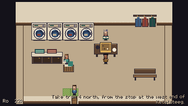

## Laundry exchange

Moss answers Abel after the opening resumes from the pause menu.

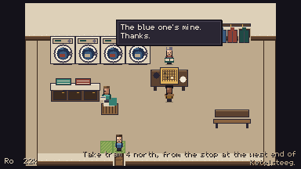

## Club

De Ketel: counter, teaching table and back table under the coats.

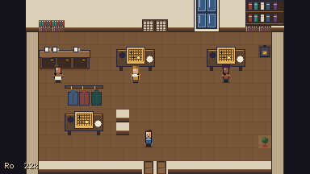

## Attic

Attic: sloping roof, skylight and study desk.

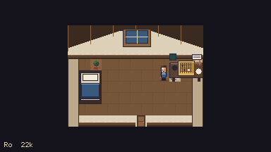

## Arches

Onderbrug: Joos keeps a dry corner beneath the arches.

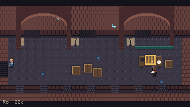

## Quay

Quay: water, bench and the readable review noticeboard.

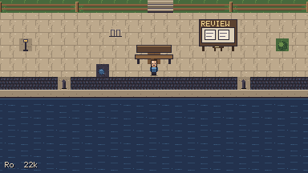

## Institute hall

Instituut: broad reception, glass and branching corridors.

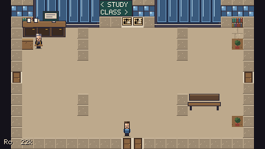

## Study

Study hall: different table arrangements and study activities.

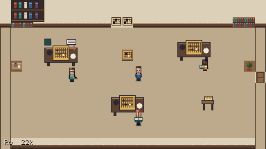

## Classroom

Classroom: seats face Hana's demonstration board.

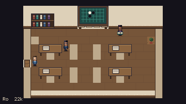

## Dorm

Dorm: bed, coat storage, bag and personal desk.

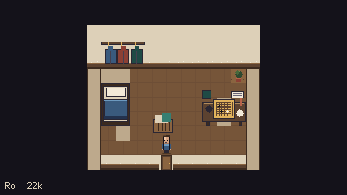

## Bondszaal

Bondszaal: long civic hall, numbered boards and entrance registration.

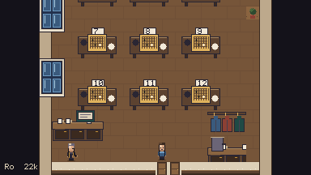

## Bondszaal front

The front of the civic hall, with tall windows and results boards.

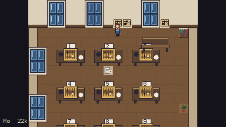

## Street

Ketelsteeg: kettle sign, laundry window and clear entrances.

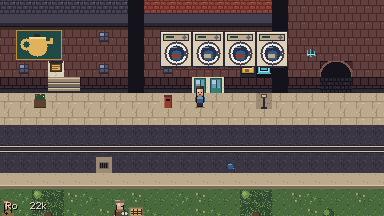

## Institute exterior

Northbound arrival: the Essenveld Instituut.

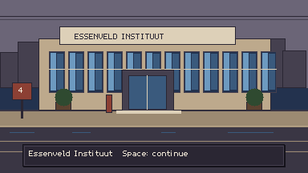

## Bondszaal exterior

Southbound arrival: the Bondszaal.

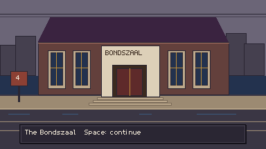

## Handicap receiving

First handicap reached from a fresh game: four Black starting stones.

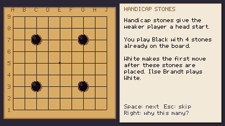

## Handicap giving

Stronger-player fixture: Ilse takes Black; the player moves first as White.

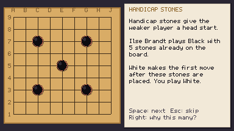

## Handicap komi

Ordinary stones, komi, the half-point and rank consequences explained.

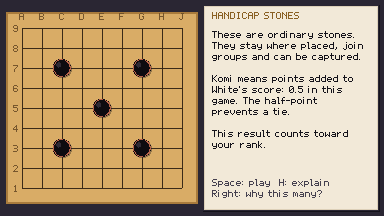

## League footer

The revised ineligible league footer, read in the fresh journey.

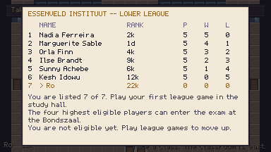

## First rank

The correct 22k card after Kesh, above the conversation.

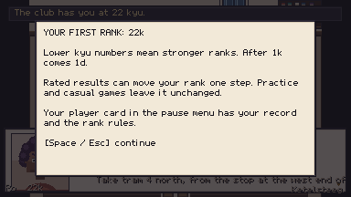

## Cup results

Winning Cup fixture: placing and the tie rule are explicit.

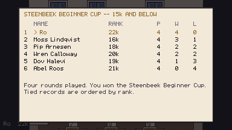

## Cup tea

Optional warmth after the winning Cup fixture.

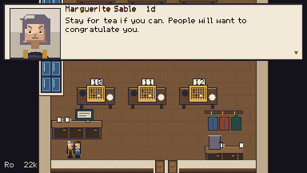

## Exam welcome

Hana welcomes the player back after an unsuccessful exam.

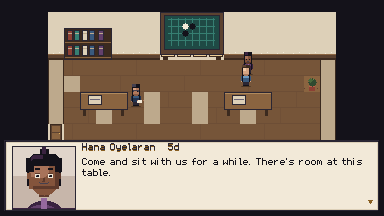

## Review return

A requested review can finish while the player is away and be read on the quay.

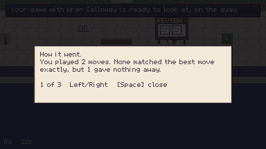
