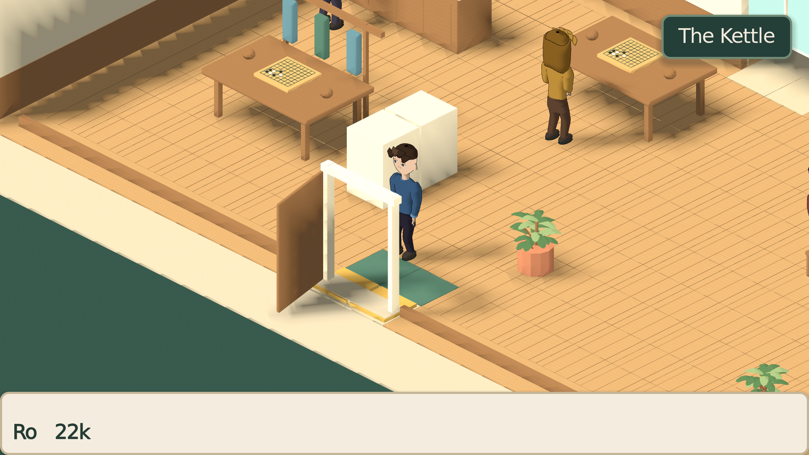
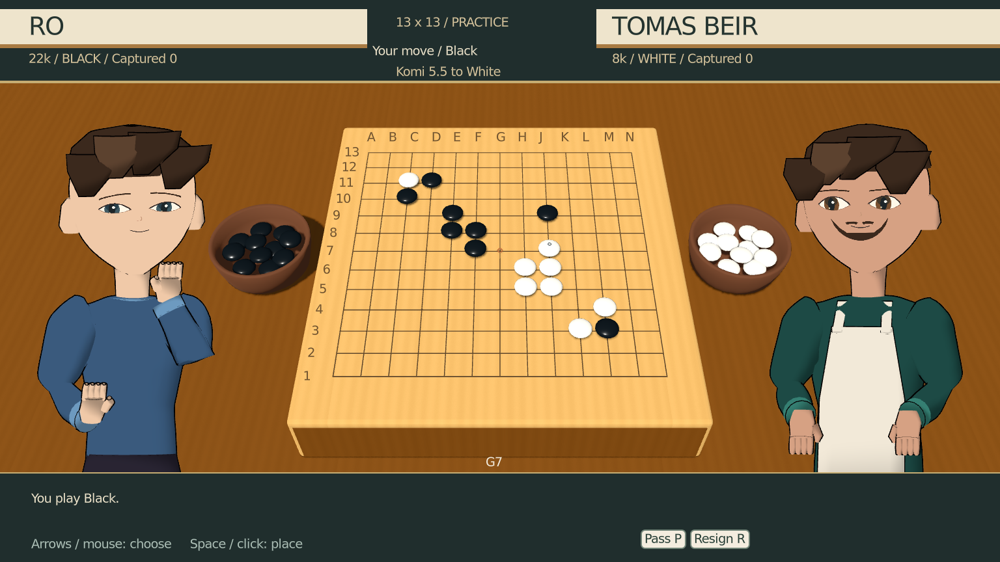

# Launch, native rendering, match frame rate and default audio

The normal launcher refreshes Godot imports and script classes before opening the game.
One retry handles a theme that initially references a missing imported font. A remaining
error stops launch and prints diagnostics. Recovery was exercised by removing the cached
font and launching through `tools/play.sh`; normal user saves were not used by tests.

`NativeViewportSize` sizes 3D render targets to their displayed pixel rectangle, including
root stretch, nested portrait scales and letterboxing. World layout and board input retain
their existing logical coordinates. Higher window resolutions require more rendering work.

The normal audio directory now contains the approved Thwack recordings, capture/bowl
contacts and new Kettle/rated-match music. Their old synthesis recipes and runtime
audition controls were removed. Other location, lesson, character and UI cues remain.
`tools/adopt_audio.py` publishes checksum-verified source renders under production names;
the audio build also publishes them, so rebuilding cannot restore the retired sounds.

Verified with isolated user data on 2026-09-13:

- `tools/test.sh`: 406 resource loads and 19,569 main checks; production audio contact,
  pure review/teaching, capture and real KataGo integration gates all passed.
- Rendered board verification: 3,806 checks, including every intersection on 7/9/13/19
  boards at 768×432, 1536×864, 1920×1080 and letterboxed 1600×1200.
- `table_adoption`: 105 checks for native world resizing, legal placements, counting,
  one saved result per game and returning to the world. Replayed after audio adoption.
- `opening`: title, Hana/board introduction and rooftop arrival inspected at 1080p.
- Production audio driver launched through `tools/play.sh`, with no audio flag:
  19 checks; effects peaked between -8.8 and -12.5 dB, music around -21.8 dB;
  intro handover and loop restarts worked. Removed audition keys had no effect.
- Audio contact: 48 checks at 30/60/144 fps, including redraw and destruction cancellation.
- Three Python audio asset tests verify source integrity and exact production bytes.

The original rendered verification used software OpenGL.
Driver measurements establish output and routing, not a new independent aesthetic review.
Full local logs and captures are under `/home/user/.cache/ninepoint-default-audio/` and
`/home/user/.cache/ninepoint-resolution/`.

The match-performance follow-up removes the production scene's forced 30 fps limit.
Matches now preserve the normal game cap and VSync behavior. Animation durations and
stone-contact timing remain based on elapsed time.

`table_adoption` now passes 117 checks, including entry/return at 30/60/144/uncapped
and placement-animation elapsed time. Its software-rendered 19×19 board and world-return
screenshots were inspected. A real-display run reached 60 fps, then failed its synthetic
mouse-hover assertion during counting; it is not counted as a complete hardware input pass.

The separate `tools/table_performance.gd` runs the full production Wren scene with both
actors and 80 legally placed stones on a 19×19 board. At 1536×864 on the Radeon RX 6900 XT,
four-second samples sustain the requested 30, 60 and 144 fps. The 30 setting reproduces
the old ceiling. This uses a random-opponent fixture held at the player's turn, VSync
disabled and isolated saves; it does not measure KataGo thinking, every monitor resolution
or long-session frame spikes. Its 332 assertions check setup, legal fixtures and cap preservation.
Run it on the real display with an absolute disposable `XDG_DATA_HOME`, as documented in
the script. Logs and inspected captures: `/home/user/.cache/ninepoint-performance/`.
The follow-up also passed a fresh editor import, 406 resource loads, 19,569 unit checks
and 48 audio-contact checks. The earlier full engine integration gate was not repeated
for the frame-cap removal.
