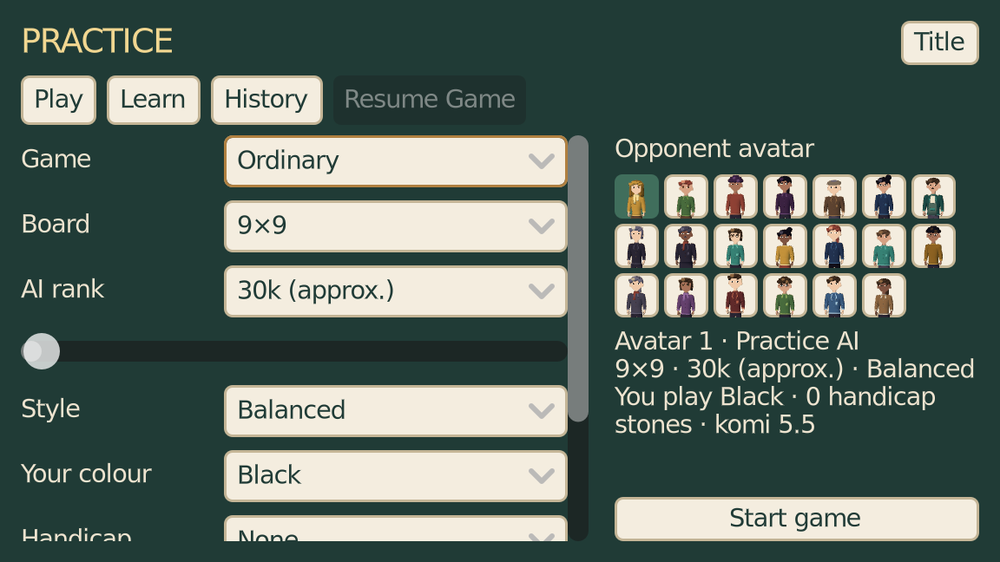
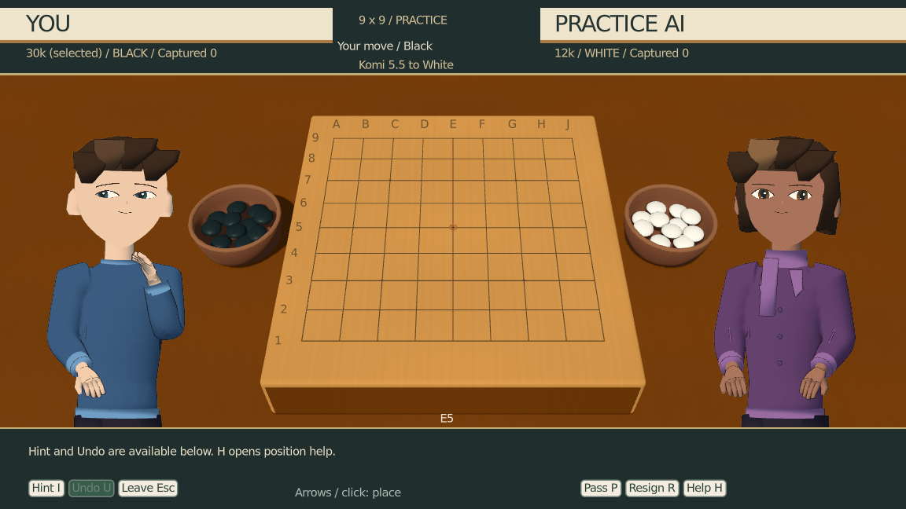
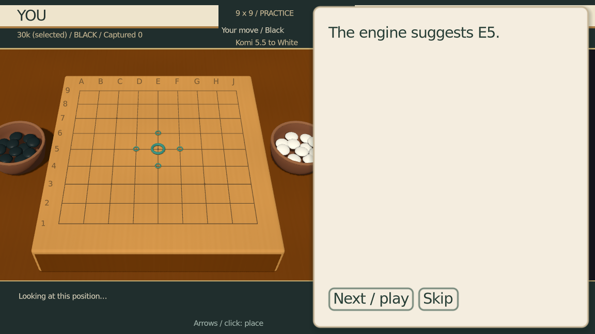
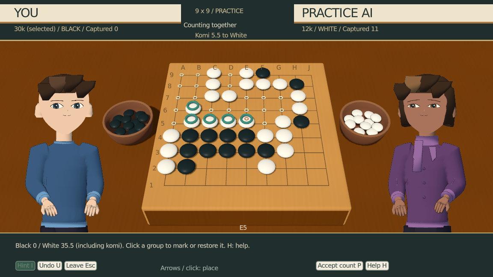
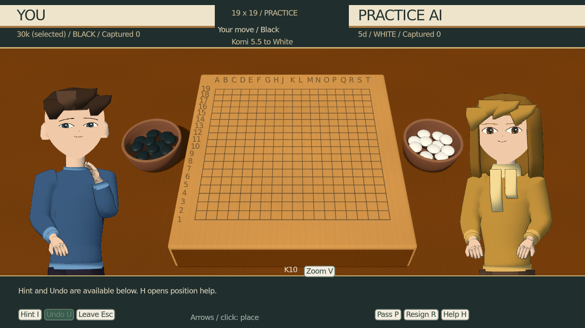
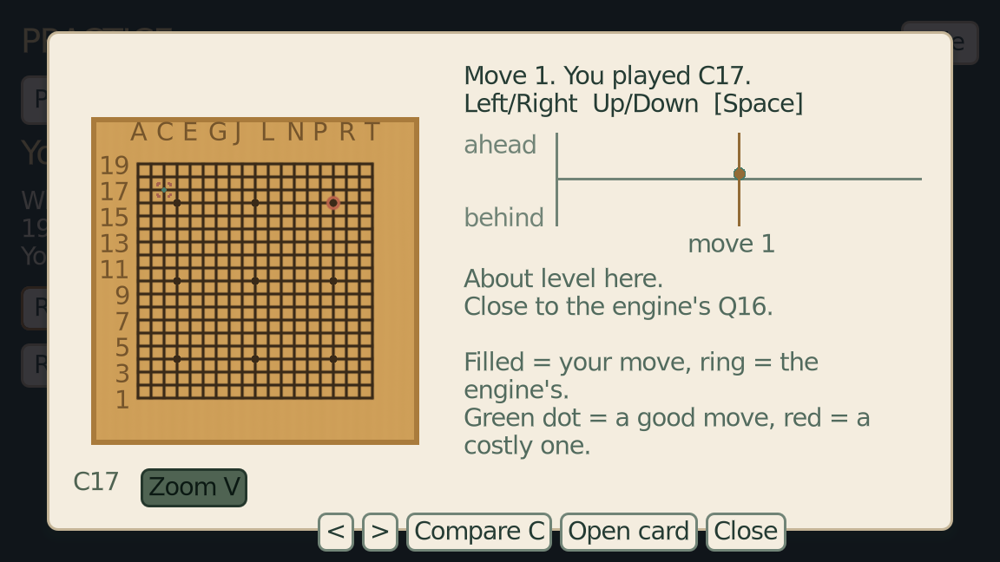
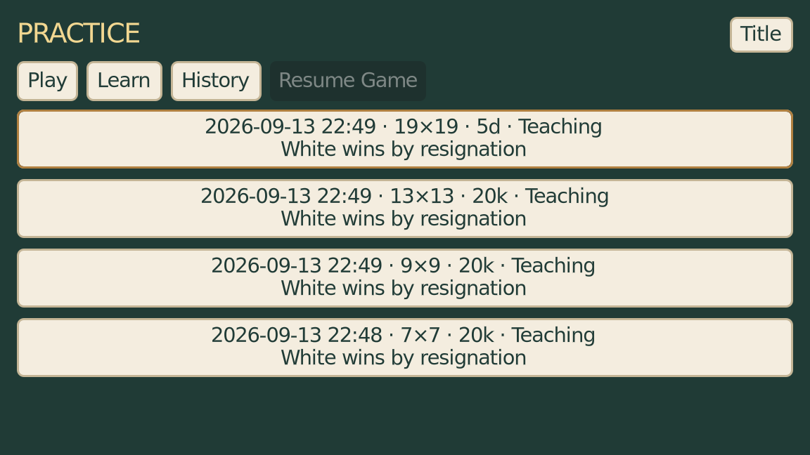

# Standalone Practice

Open **Practice** on the title screen. It works without a campaign save. The newer
campaign-preview character models, expressions and Go table are used here; the RPG's
presentation setting is unchanged. Opponent avatars are cosmetic, not copied NPCs.

## Play

- Ordinary or teaching game on 7×7, 9×9, 13×13 or 19×19.
- Discrete rank slider and exact selector from 30k to 5d. 30k–21k are approximate
  beginner targets; native Human-SL settings start at 20k. Automated checks do not
  certify a human rank, particularly on small boards.
- Steady, balanced or fighting style; Black, White or nigiri; no handicap,
  automatic handicap from a self-selected player rank, or manually assigned stones.
- Automatic/manual handicap shows the final colours, stones and komi before starting.
  In manual games the selected colour decides whether you take or give the stones.
  The advanced section exposes a custom komi override (including handicap games)
  and a separate practice name.
- Capture Go has its own transparent first-capture opponent, without full-Go rank,
  handicap or komi settings. Two passes end neutrally; resignation is a loss.

Default: ordinary 9×9, approximate 30k, balanced, Black, no handicap, 5.5 komi.
Your last settings are remembered. Scroll the setup column for handicap/advanced
settings; the avatar selection, summary and Start Game remain visible beside it.

At the board, click or use arrows and Space. **P** passes or accepts counting,
**R** offers resignation, **H** opens available help, and **Esc** opens Save and
Return / Discard Game / Continue Playing. Teaching additionally offers **I** for a
hint and **U** for takeback, plus a coaching and liberty-display switch in Help.
Takeback returns to the previous player decision, including during AI thinking
and from counting. Hints do not play the move. Explanations claim only consequences
supported by the rules or engine evidence.

A suspended game resumes its committed history, colours, captures, ko, passes and
counting marks. Starting another game asks whether to resume or replace it.
KataGo failures explain that the local fallback cannot represent the chosen rank;
continuing locally or saving and leaving remain available.

## Learn and History

Learn contains every existing lesson and puzzle, grouped into basics, finishing/counting
and tactics, plus a beginner sequence. No RPG progress is required. Completion marks
belong only to Practice and never grant ranks or campaign flags.

Completed games have replay, requested engine review, SGF export, rematch and setup
options. Replay works without KataGo. Reviews reuse the whole-game graph, best-move
explanation, costly positions and lesson links. Reviews can finish while browsing
Practice; a new game cancels unfinished analysis, which can be retried later.
Exports are saved under `user://practice/exports/`, with the absolute path displayed.

Practice data lives in **`user://practice/state.json`**, version 1, separately from the
three campaign slots. It contains settings, completion markers, history, review payloads
and one suspended game. Atomic temporary-file writes preserve the previous good save;
malformed existing data is retained with an error rather than silently replaced.
Unfinished reviews become interrupted after a restart; games resume, engine processes do not.

## Development and verification

```bash
python3 tools/gen_practice_profiles.py
python3 tests/test_practice_profiles.py
XDG_DATA_HOME=/home/user/.cache/ninepoint-practice-test tools/test.sh
TIMEOUT=600 OUT=/home/user/.cache/practice-core LOG=/home/user/.cache/practice-core.log tools/run_rendered.sh tools/autopilot/standalone_practice.json
DISPLAY_NUM=0 TIMEOUT=400 OUT=/home/user/.cache/practice-engines LOG=/home/user/.cache/practice-engines.log tools/run_rendered.sh tools/autopilot/standalone_practice_engines.json
TIMEOUT=180 OUT=/home/user/.cache/practice-layout LOG=/home/user/.cache/practice-layout.log tools/run_rendered.sh tools/autopilot/standalone_practice_layout.json
```

Run game/engine routes serially. The rendered launcher supplies disposable user data.
`tools/practice_session_test.gd` is included in the technical gate and tests undo while
an opponent is thinking, stale replies, counting resume/takeback, fallback return,
duplicate completion, review failure and unchanged campaign state/slot bytes.

### Acceptance evidence (2026-09-13)

Implementation started from freshly fetched `06a263d` with matching HEAD/origin/main,
on `codex/standalone-practice`. All runs below use isolated user data and run serially.
No new illustration assets or character profiles are generated for avatars.

- Full `tools/test.sh`: compilation, 426 resource loads, 21,145 unit checks (1,551 Practice checks), Python
  profile generation, pure review (130), practice session (16), contact timing (48),
  teaching worker (31), teaching scene (43), capture scene and all three engine gates passed.
- `tools/check_lessons.py`: no problems.
- Core Practice route: 17 assertions passed, including title entry, all three campaign
  slots unchanged, lesson/puzzle completion, neutral Capture Go and replay, real teaching
  play, disk restore, undo, hint, a full 9×9 count, result and SGF export.
- `standalone_practice_engines`: 23 assertions passed; real native-rank replies and
  legal hints on all four board sizes, no fallback, and a nineteen-line engine review
  completed while browsing Learn (3/3 positions, 45.2 seconds). Completed review and
  all four records were read back from Practice.
- `standalone_practice_layout`: starts with no save slots; 12 assertions passed for
  the 1k→1d transition, maximum
  rank, automatic/manual handicap, custom komi, history width and presentation reset.
- Campaign `teaching_wren`: real evidence-based question, provisional undo/retry, Help,
  coaching off, result/reaction and return. `rendered_match`: nigiri, count, result,
  completed graph/cards and walking after review. Both passed with no script errors.
- An initial software-rendered teaching run missed the existing two-second comparison
  deadline. The hardware-rendered route passed without changing campaign engine settings.
  The nineteen-line Practice opponent needed an eight-second reply allowance; its
  real-engine rerun passed without fallback.

The practice session gate also injects a delayed opponent and missing engine, verifies
stale reply rejection and a saved return, restores counting marks, prevents duplicate
completion, and checks all campaign memory plus all three slot files byte for byte.
Pure tests replay a legal capture/ko/recapture history, preserve prisoners and ko bans,
cover handicap limits and every rank/style/size configuration, and retain a valid store
when a temporary write is interrupted or an existing file is corrupt.

Representative frames were opened and inspected. Layout inspection corrected an
oversized avatar grid, clipped Start button and a long history row. These are actual
Practice scenes using existing newest-generation models:









Additional inspected evidence: [no-save title](screenshots/title.png),
[advanced komi](screenshots/custom_komi.png), [library](screenshots/library.png), [lesson](screenshots/lesson.png),
[Capture Go](screenshots/capture.png), [resume hub](screenshots/resume.png),
[7×7 hint](screenshots/seven_hint.png), [19×19 hint](screenshots/nineteen_hint.png),
[campaign teaching](screenshots/campaign_teaching.png),
[campaign review](screenshots/campaign_review.png),
[campaign return](screenshots/campaign_return.png).

Automated engine play establishes functionality and relative settings, not independently
certified beginner ranks. 30k–21k remain explicitly approximate.
