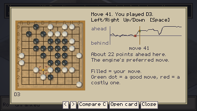
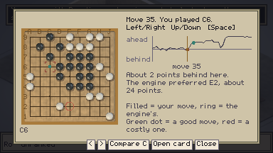
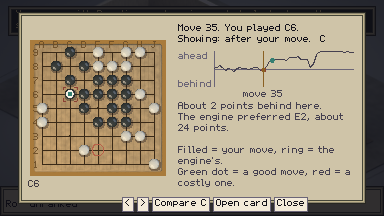
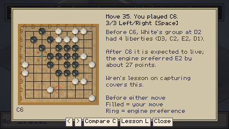
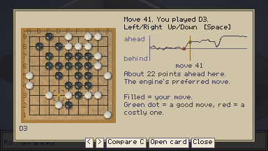
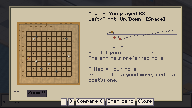
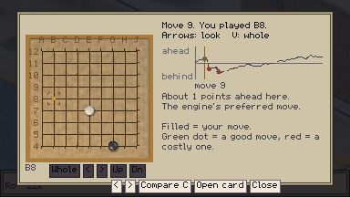
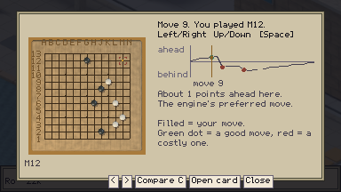
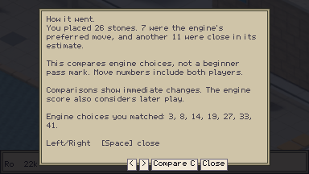

# REV-04 — Graph-first review

Branch `claude/review-graph-poc` from `origin/main` `725aa6c`, 2026-09-12; delivered as
M54. It began as a proof of concept for the owner's question after REV-03: is the card
review worth keeping, or should the game show the score graph every Go site shows? The
graph was built on the existing analysis, the owner played it and preferred it to main,
and the feedback was folded in. Nothing is cut yet: the cards and the second analysis
pass are unchanged (see REV-05 in the workboard).

## What it does

- The review payload gains `curve`: for each of your moves the engine saw, your estimated
  lead afterwards, what the move cost, and the played and preferred points as labels.
  It comes from the eight-visit pass that already runs; a 9×9 game adds about a kilobyte.
- The first review card is the graph. The board on the left shows the position before
  the selected move, your move filled and the engine's preference ringed, exactly as on
  the cards. The caption says in words how far ahead or behind the engine thought you
  were after that move, and what it thought of the move. The axis reads "ahead" and
  "behind" rather than numbers: an early frame with "+50 / -50" and a bare "63" under
  the cursor was read as "a -63 advantage", so the number now lives only in the caption.
- Left/Right walk your moves. Up/Down jump between the explained positions, drawn as
  dots; the legend says "Green dot = a good move, red = a costly one". Space or the
  **Open card** button opens that position's card, and the button is greyed on moves
  that have none. Left from the cards returns to the graph at the same move. Compare C
  works as on the cards and the title says what is showing ("Showing: after your
  move"). Nineteen-line zoom works as before. Escape closes. Clicking the graph selects
  a move.
- It opens on your praised move, so what went right still comes first.
- Saves without a curve (every review before this branch) render the old tally card.

## What it does not do yet

- The second analysis pass still runs and the cards still use it. The graph caption
  rounds the pass-one loss, the card quotes the 200-visit comparison, so the same move
  can read "about 24 points" on the graph and "about 27" on its card.
- No numbers for the opponent's moves, no winrate, no per-move top-move list. One line,
  your view.
- Nobody outside this session has used it.

## Evidence

`review_graph`: a whole 9×9 to the count against the weak fixture engine, the review,
then the graph interactions. Frames opened:

Thirteen and nineteen lines use the `quay_review_13` / `quay_review_19` save presets,
whose review is a synthetic fixture: a scattered replayable game, a fixed random-walk
curve, and the preset's three findings on Black's moves. They prove layout and controls,
not engine output. `quay_review` (nine lines) keeps the pre-graph payload on purpose and
still shows the old tally card.

Gate: **18,239 / 0**, 332 files load, 13 art tests, all engine gates, exit 0.

## The decision this is for

If the graph is the spine, the second pass buys ownership tints, continuation lines and
the group facts, at about 32 of the review's 45 seconds and most of its code. Play both
versions on a few real games, then choose: keep the cards as annotations (this POC),
keep only the graph and one template sentence per mark, or keep everything.
