# REV-01 verification — Steps 1–4 complete

## Step 1

Base HEAD and freshly fetched origin/main both `37d007c`; work is on
`codex/rev-01-review-facts`. Existing untracked files were preserved.

The first 9×9 measurement exceeded the approved budget: pass 1 14.661 s, pass 2
50.377 s, nine queries at 200 visits. Work stopped and the owner approved reducing
only pass branches to 50 visits. Actual and best branches remain at 200.

The first full gate with that adjustment passed 18,055 unit checks, 317 file loads,
13 art tests and all integration gates. 9×9 timings were 14.922 / 33.382 s;
19×19 timings were 61.275 / 46.460 s. Saved review bytes were unchanged at
4,640 and 13,932 respectively. The existing 19×19 fixture had reached its move cap
without ending; it now passes to finish, and final whole-game measurements follow.

`rendered_match` ran with isolated user data at
`/home/user/.cache/ninepoint-rev01/play-step1`, producing 18 frames, exit 0 and no
script errors. This is an eight-player-move regression route, **not** the final
abandoned-group acceptance. It used Wren's normal profile, player White, no handicap.
The loading label, legacy mistake text and return to the room were opened and inspected.

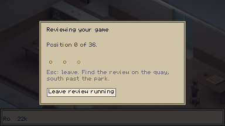
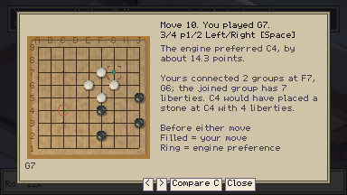
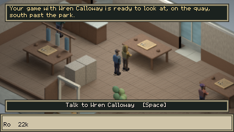

Final Step 1 full gate after fixing the ending: **18,055 / 0**, 317 loads, 13 art
checks and all engine gates pass. The finished 9×9 has 78 moves, pass 1 **14.846 s**,
pass 2 **31.850 s**, saved review **4,639 bytes**. The finished 19×19 has 242 moves,
pass 1 **61.661 s**, pass 2 **45.597 s**, saved review **13,946 bytes**. Both sizes
return all nine detail branches. Detail rejection preserves the exact legacy payload;
detail cancellation terminates its pipe; the stalled engine fails within 6.1 seconds.
The 45-second acceptance budget applies to 9×9 pass 2. Shutdown resource-leak warnings
remain visible in logs; no script or parse errors occurred.

## Step 2

Fixtures, including White orientation, were written and registered before functions.
The recorded red run failed because `ReviewFacts` did not exist. The final pure tests
cover all six detectors, region ordering/limits, thresholds, coordinate validation,
legal capture proof, malformed lines and exact colour-mirrored equivalence.

Full gate: **18,110 / 0**, **320 loads**, 13 art tests and all engine gates pass.
9×9 pass 1 / pass 2: **15.032 / 34.285 s**; 19×19: **61.904 / 45.073 s**.
`tools/test_review_pure.sh` copied only Go rules, the facts/continuation helpers and
fixtures into a disposable project: **55 passed / 0 failed**, with no engine files,
scene tree access by the helpers, or game autoloads. No player-facing change in this step.

## Step 3

Pure deterministic narration covers the group, liberty count, legally replayed capture,
rounded point cost and existing lesson. Ownership-only predictions explicitly say the
engine expects them; no capture is claimed without legal replay evidence. White uses
player/opponent roles to assign colours. Coordinate validation also rejects out-of-board
and unsupported coordinates in saved prose.

Full gate: **18,138 / 0**, **322 loads**, 13 art tests and all engine gates pass.
Final pass 1 / pass 2: 9×9 **15.053 / 32.002 s**, 19×19 **62.469 / 45.100 s**.
The isolated facts/narrator project passes **83 / 0**. This step adds no runtime UI.

## Step 4

Optional enrichment now reaches payloads, packed runtime maps, JSON save/load and cards.
Narration is validated at sealing and display; bad enrichment keeps the legacy critique.
The comparison tint uses player-relative ownership only on empty intersections, with
lost-region outlines and the existing marker/zoom geometry. Lesson L returns a request
to the world/desk owner, which uses the existing lesson runner.

Early real Wren routes did not find a qualifying two-liberty abandonment; these runs
are **not** acceptance evidence. The hidden renderer is capped (MAX_FPS=30 for these
runs), and the developer player is seeking a viable isolated C3 group while Wren uses
her shipped profile. Reference searches belong to the test player, not Wren or live
teaching. No capture claim is fabricated from an ownership prediction.

### Actual Wren game

`rev01_wren` played Wren's shipped 20k Human-SL profile from an empty 9×9,
Black, no handicap, 5.5 komi. Its disposable request pins Black like the existing
KataGo trial; it uses the normal world match/result/reaction/review path. Wren chooses
every reply. The game ended after 57 plies; White won by **13.5 points**.

Black deliberately played A9 instead of saving F2, whose two liberties were G2 and F1.
Wren initially played elsewhere; the driver continued leaving F2 alone and Wren captured
it. The before/capture/result screenshots below were opened and inspected. The actual
SGF and recorded target are in [wren-played.json](wren-played.json).

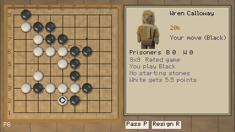
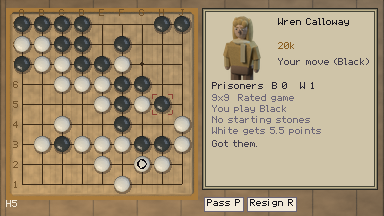
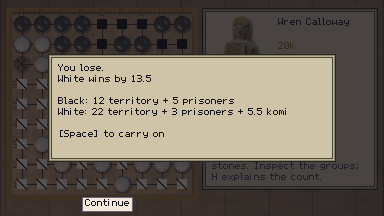

The review selected the later missed rescue, move 29 (J9), at about 19 points, rather
than the initial move 25 (A9). Its PV begins White G2, Black H5, then moves elsewhere;
the initial narrator correctly said “expects” instead of inventing a capture. A separate
rules replay verified White G2 → Black H5 → White F1 captures F2. The owner approved
extending the literal PV with that explicitly labelled legal example after clarification:
it proves a possible capture, not a forced result, and the point cost remains a separate
engine estimate. The implementation preserves the PV and replays loaded examples.

### Integration evidence inspected

Full gate: **18,200 / 0**, **325 loads**, **101 / 0** in the isolated pure project,
13 art tests and every integration gate pass, including a session reset during pass 2.
Final log: `/home/user/.cache/ninepoint-rev01-step4-approved.log`.
Measurements use the same raw game for legacy and enriched payloads, identical JSON
indentation and complete-save headers, with isolated absolute XDG data directories.

| Board | Pass 1 | Pass 2 | Review bytes before → after | Complete save bytes before → after |
|---|---:|---:|---:|---:|
| 9×9, 78 moves | 14.888 s | 31.112 s | 4,639 → 10,055 (+5,416) | 6,957 → 13,721 (+6,764) |
| 19×19, 242 moves | 64.443 s | 47.909 s | 13,947 → 48,279 (+34,332) | 20,613 → 64,565 (+43,952) |

The actual Wren SGF was re-analysed as Black (10.214 / 30.031 s) and in a White
colour mirror (11.062 / 31.266 s). The mirror swaps every stone/move, negates komi,
and prepends a Black pass to retain the existing legal B-first SGF subset. Thus move
29 becomes move 30. Both cards name F2, G2/F1 liberties, 19 points and Kesh's lesson;
PV colours reverse. Their region members, 18-point region value and all other facts
agree; the maximum-delta region anchor varies from F2 to G2 between engine searches.
The exact synthetic colour-mirror fixtures remain identical in the pure tests.

Both 23-frame `rev01_inspect` routes passed and were opened. Keyboard Lesson L opened
Escape from Atari; all three steps were exercised through board input, then the player
returned normally to the quay. Saving/reloading retained records and the review. The
19×19 route covers ownership in both comparisons, whole/close views and cursor movement.
The legacy route retained the old text, controls and untinted comparisons before and
after save/load. Images below record those earlier inspections, before the approved capture-example extension.

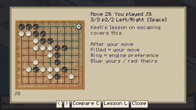
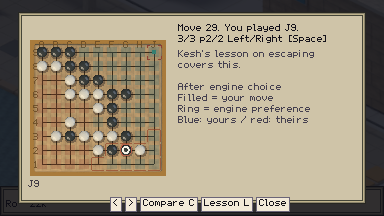
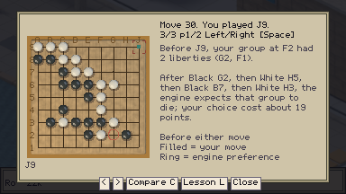
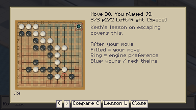
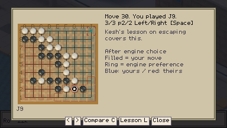

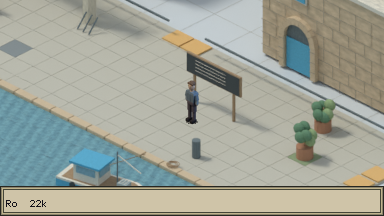
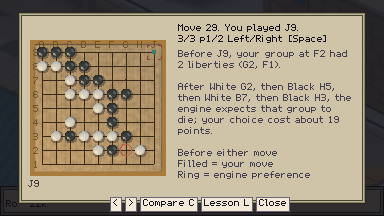

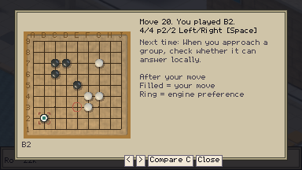
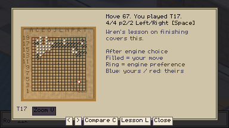
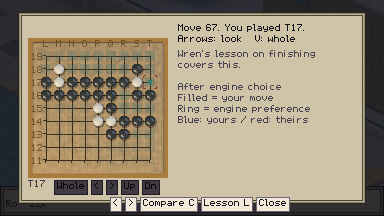

The additional quiet renderer fixture kept one measured steady summary and no lesson/tint;
its first run lacked the SGF eligibility field, which was fixed before the successful run.
A second nineteen-line inspection moved through the real arrow controls to the preferred
point and opened the enlarged lost-region outline. A White fixture run clicked Lesson L,
completed Escape from Atari and saved/reloaded the retained review. These frames were opened.

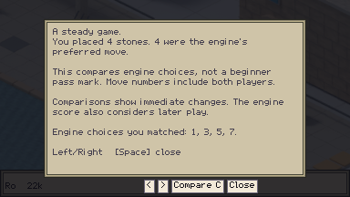
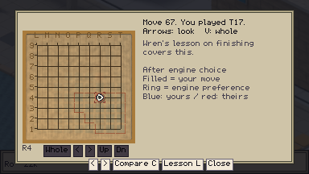
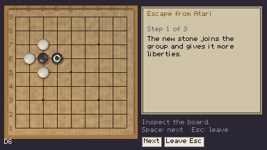

The final 23-frame Black inspection also passed after the summary wording change.
The summary and praise card were opened: text fits, praise keeps its existing immediate
effect, and the ownership summary describes the new tint.

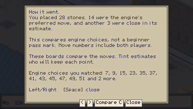

## Approved capture example: final acceptance

The approved extension's fixtures were written before the implementation (red exit 1),
then passed in the engine/game-absent project. They keep the engine PV separate, preserve
exact colour symmetry, refuse illegal/missing lines, and prove the named chain is captured.
Save tests reject forged example moves/capture lists and retain valid examples on disk.
The pure harness now prints failed assertions before exiting.

The final cards come from fresh analysis of the actual 57-ply Wren SGF above, plus its
colour-mirrored White developer fixture. No game moves or engine ownership were fabricated.
Black passes: **10.372 / 29.872 s**. White passes: **10.593 / 30.535 s**.
Both select J9, F2, liberties G2/F1, the three-move capture example and about 19 points.
All resulting facts match apart from the largest-delta region anchor (G2 versus F2);
the same ten region members, 17-point region estimate and player/opponent move roles match.
The card's 19-point cost is the whole-move engine estimate, not the region estimate or a
claim that the illustrative line is forced. The White game adds an initial Black pass,
so the same decision is move 30 rather than move 29.

The keyboard Black and clickable White acceptance routes each passed with 22 frames.
Both pages of each mistake card were opened, along with actual/best ownership comparisons,
Escape from Atari feedback and the reopened review. Three lesson steps passed; returning
kept the review, results and rank. A further 23-frame White route saved, reloaded and
reopened the example; its final card was opened. The existing quiet, legacy and nineteen-line
inspections above remain valid. A later unmodified-PV Wren attempt found no qualifying
abandonment; it is not substituted for the recorded game above.

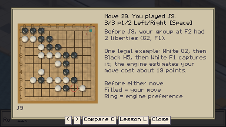
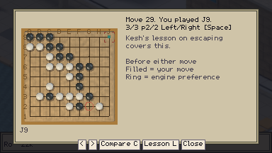

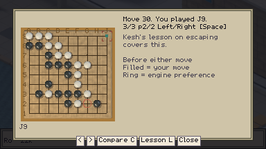


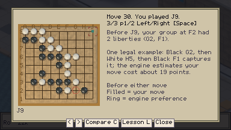

### Reproduce the inspected cards

The recorded engine payloads are [Black](wren-review-black.json) and
[White](wren-review-white.json). Run serially with absolute XDG/OUT/LOG directories:

```bash
XDG_DATA_HOME=/home/user/.cache/rev01-replay-black \
REV01_REVIEW_FILE="$PWD/docs/review/wren-review-black.json" \
OUT=/home/user/.cache/rev01-replay-black-shots LOG=/home/user/.cache/rev01-replay-black.log \
MAX_FPS=30 tools/run_game.sh tools/autopilot/rev01_fixture_keyboard.json

XDG_DATA_HOME=/home/user/.cache/rev01-replay-white \
REV01_REVIEW_FILE="$PWD/docs/review/wren-review-white.json" \
OUT=/home/user/.cache/rev01-replay-white-shots LOG=/home/user/.cache/rev01-replay-white.log \
MAX_FPS=30 tools/run_game.sh tools/autopilot/rev01_fixture.json
```

All Steps 1–4 criteria, including the owner-approved legal-example amendment, are met.
Step 5, LLM narration, opponent strength/ranks, policy commentary and new lessons remain
unstarted. Known shutdown-only ObjectDB/resource warnings remain; there were no script,
parse or compile errors in successful acceptance routes.
