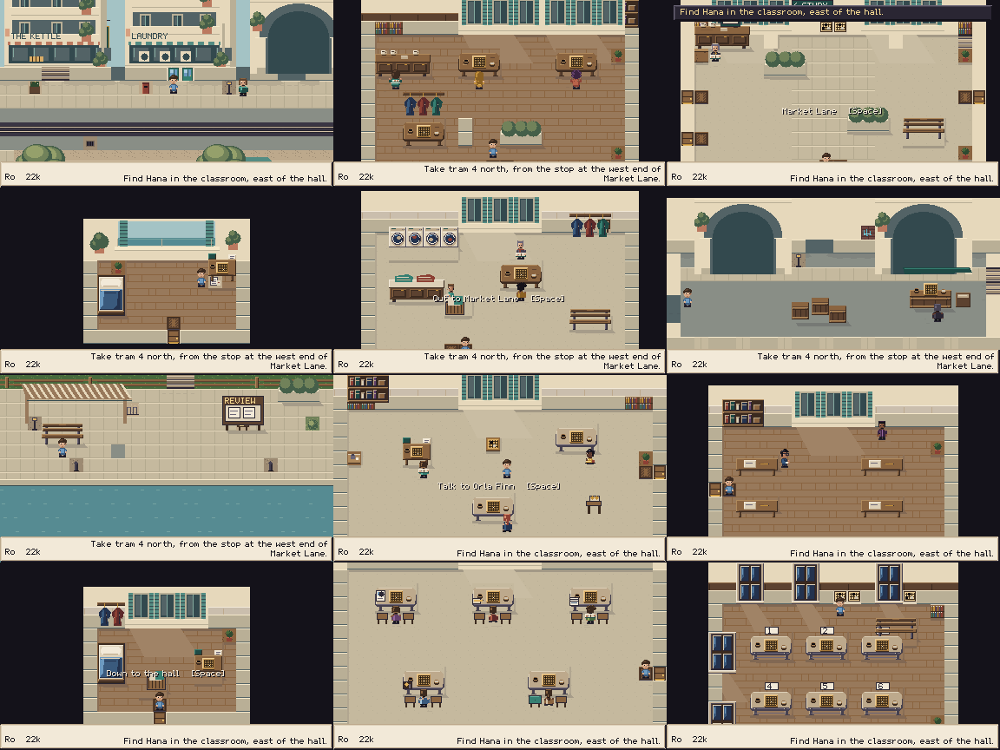
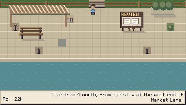
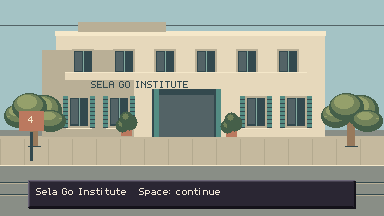
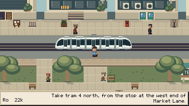
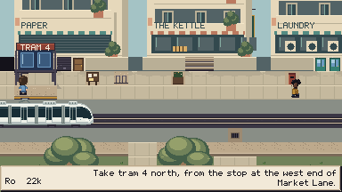

# Sela: implementation and observed play

Branch: `codex/sela-coastal-redesign`, based on freshly fetched and verified
`origin/main` / HEAD `d64ab5f1c0534d2912ffbb91b37f1dd864292c05`.
Approved direction and inspected photography: [DESIGN.md](DESIGN.md).

## Implementation

All twelve venues have coastal materials and architecture. Market Lane, Sea Walk and the
Arcade form an ungated loop in both directions. The bar retains its intimate furniture;
the institute has a planted court and open shutters. Title and tram views share the new
setting. Exterior sound uses Python-synthesized breeze and surf; existing music is retained.

The cast is protected by 73 original export hashes, including portraits, walking and
activity sheets. Character definitions, opponent profiles, Go rules, lesson data and
board/UI art are unchanged. Environmental wording and place names are updated, while
voice and win/loss branches remain intact.

A separate world-layout revision migrates old exact positions to their existing named
spawn once. Rank, flags, quests, results, leagues and Cup/exam state remain intact. Current-layout
stored return coordinates remain intact. The pure save tests cover old/current positions and retained
progress; generated fixtures now carry the layout revision.

## Technical evidence

- `tools/test.sh`: 16,904 Godot checks, zero failures, 283 loaded files, all three real
  KataGo integration gates passed. The run included 12 art tests; the subsequent expanded
  art suite passed all 13 after adding an explicit connected-service test.
- `python3 tests/test_art.py`: all 13 passed. Includes exact protected exports, deterministic
  isolated environment builds, map validation, six directed loop connections and walkable
  approaches to every spawn, warp, NPC and sign in every map.
- In-memory deliberate breaks were rejected: a blocked Sea Walk route failed the connected
  service assertion; an altered protected-character digest failed the hash contract.
  No production asset or map was modified for these checks.
- `tools/check_audio.sh`: all 18 tracks audible and four intro stings handed over.
  Surf measured −25.4 dB and breeze −33.4 dB through the real audio driver.
- `git diff --check` passed. Dialogue changes were read through `check_dialogue.py`; normal
  data tests enforce graph branches, writing limits and post-match outcomes.

## Played routes

Each route
has its own declared save. Gameplay used `/home/user/.cache/ninepoint-sela/play` as
`XDG_DATA_HOME`; tests/audio used `/home/user/.cache/ninepoint-sela/test`. Original player
save slots were not used. The runner's exclusive lock kept gameplay runs sequential.

| Route | Final evidence |
|---|---|
| `kesh_skip` | 80 captures; New Game, Capture Go, rules/finishing, supported practice loss and reaction, optional Kesh skip, real tram, Hana's Two Eyes, registration, novice room and disk reload. Exit 0, zero script errors. |
| `sela_loop` | 14 captures; all six directed edges walked, threshold prompts and arrivals inspected, saved and reloaded. Exit 0, zero script errors. |
| `art_tour` | 18 captures covering all twelve maps, washer motion, garden and novice aisle. Every venue inspected in the final contact sheet. Exit 0, zero script errors. |
| `art_arrivals` | 14 captures; title, both real tram trips and their destination illustrations, federation furniture. Exit 0, zero script errors. |
| `novice_losses` | 86 captures; five recorded losses, four handicap Cup rounds, beginner ending and repeat league at zero. Standings, final setup and ending inspected. Exit 0, zero script errors. |
| `early_quay` | 10 captures; played/engine comparisons, unchanged result history and disk reload. Comparison and Sea Walk return inspected. Exit 0, zero script errors. |
| `early_skips` | 27 captures; tutorial cancellation/skips, supported-practice prompts, school access, registration and reload. Final court/registration state inspected. Exit 0, zero script errors. |
| `portrait_sprites` | 19 captures; running, work poses, far-seat sorting and five conversations. Wren, Kesh, Tomás, Nadia and Sunny inspected against their new surroundings. Exit 0, zero script errors. |
| `sela_legacy` | Five captures; an old coordinate in the new bench becomes the named safe arrival. A second, current-layout slot loads its stored coordinate and survives a menu save/title reload at that coordinate. Both ranks/records and invitation flags verified. Exit 0, zero script errors. |

Nine final routes produced 273 captures. The table identifies what was inspected; not every
intermediate lesson frame was individually opened. No final route logged an unreachable tile.

## Corrections found by looking and playing

The first Sea Walk shelter occupied the entrance composition, making an arriving player
look as though they stood on its roof. The final shelter and bench sit to the side, leaving
the steps and through-route clear. Water ripples were reduced to avoid a repeated stripe
pattern. Tree canopies and kiosk fringes have restrained local animation.

The old `kesh_skip` duplicated an obsolete lesson sequence and stopped at `lesson_place`.
It now uses current named choices and the lesson runner. Its return from Hana's class waits
for the world transition before dismissing her directions. `slice_full` was retired;
README, AGENTS/CLAUDE and the runner point to the current routes. Earlier play reports are
explicitly historical. Initial failed routes are not counted as completion evidence.

## Limits

These are scripted journeys and visual inspections, not independent beginner playtests.
The fresh route uses automated Capture Go and resigns Wren's practice to inspect the loss
reaction. The Cup loss route deliberately resigns fixtures; it proves access, result flow
and completion without wins, not opponent strength or satisfying match duration. Review
comparison uses a prepared history. Room tours use direct map setup; the separate loop
route and fresh journey provide actual walking/tram evidence.

No claim is made to resolve PROG-01 strength calibration, ENG-09 endings, nineteen-line
town teaching, or unaided newcomer wayfinding. Human feedback remains the next quality
check for the new setting.

## White articulated tram — SELA-04 follow-up

The owner supplied a modern white light-rail photograph. The generated tram now has
five articulated sections, a continuous dark window band, rounded cabs at both ends,
roof equipment and small lamps. Its 160×36 silhouette replaces the 96×36 red tram;
`Tram.WIDTH` changes with the texture. The central door aligns with the existing stop.
Characters, route choices, boarding timing and destination illustrations are unchanged.

`art_tram` produced 93 captures, exit 0 and zero script errors. Opened the westbound
crossing (frame 9), eastbound crossing (57), stopping position (82) and both
arrival illustrations (84/90). No unreachable tiles were logged. `tools/test.sh` passed
16,904 checks, 13 art tests, 283 loaded files and all three KataGo gates, unchanged from
the prior Sela verification. No new test-only runtime hook was added.

Reproduce with an isolated `XDG_DATA_HOME` and
`tools/run_game.sh tools/autopilot/art_tram.json` (`TIMEOUT=240` permits the two ambient passes).

