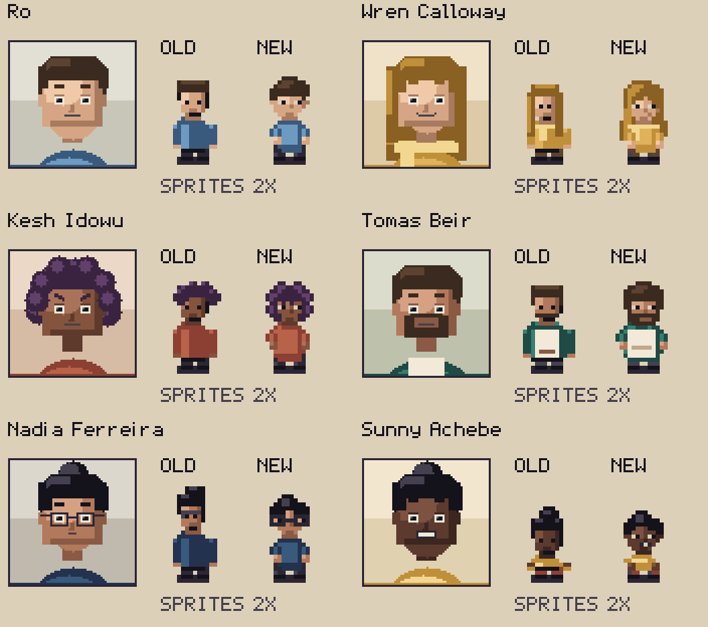
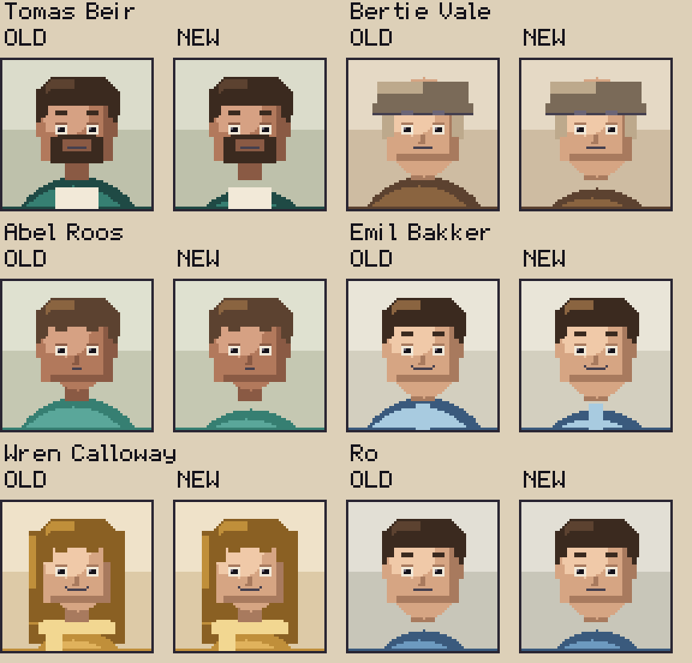

# ART-06 — Portrait-led character preview

Implemented on `codex/portrait-led-sprites`, from freshly fetched and verified
HEAD / `origin/main` `ee5377535c7c8b94730c39ccb3b26dbb22a0682e`, 2026-09-08.
This delivers the requested six-person review package; the remaining world sprites
have not been restyled. M47 remains the history of the preceding art pass.

## What changed

Ro, Wren, Kesh, Tomás, Nadia and Sunny have shaped crowns and fringes, distinct
face outlines, clearer eyes/glasses, sloping shoulders and bent activity poses.
Kesh's curls now frame her face; Wren's long hair has an uneven lower edge;
Tomás carries his beard and apron; Sunny retains a shorter child's body.
Side views keep the face in front of the hair mass and back views keep the same
hair/clothing identity. The new geometry is drawn in Python at native size.



The overview enlarges each sprite 2× relative to its portrait for close inspection,
then enlarges the whole sheet 3×. Use the full comparison for equal native pixels:
[native comparison](comparison.png) · [3× comparison](comparison-3x.png).
FR/LT/RT/BK are the four facings, A/B the two walking frames, W1/W2 the two frames
of that person's activity. Actual wood/concrete floor tiles sit beneath the feet.
The old rows come from the exact base commit, not a reimplementation of the old art.

## Owner's portrait clarification

The owner asked for consistent floating necks, then clarified that this referred
to **portraits**, citing Tomás, with Wren's scarf as an exception. Sprite necks
retain the original preview treatment. Broad unscarved portrait shoulders now
start five pixels lower, at the same height as the slim shoulders.

Only Tomás, Bertie, Abel and Emil's portrait strips changed. All pixels above row 49
are unchanged across all seven expressions; faces, hair and expression geometry are
exact. The other seventeen complete strips, including Wren and the other scarf
wearers, are byte-for-byte unchanged. Working hands/props may cross the neck gap.



The original portrait baseline is retained. A separate neckline baseline records
the four approved full-file hashes and original face-region hashes. The art tests
also require the central neck gap in every non-working, unscarved portrait expression.

## Played and inspected

`portrait_sprites` completed its 46 steps, produced 19 screenshots and exited 0
with zero script errors. Saves were isolated under
`/home/user/.cache/ninepoint-sprite-preview-play`; player saves were not used.
The final route was replayed after the portrait clarification and a fresh import.
All final captures were opened in integer 2× contact sheets, with representative
conversation and movement captures also opened at native 384×216.

| Scene | Evidence |
|---|---|
| Walking/running and collision | [Running on Ketelsteeg](screenshots/01_running_ketelsteeg.png). The live probe measured 1.750× running speed and checked release, collision and menu input lock. |
| Club cast and tables | [Room](screenshots/02_club_cast.png), [Wren's far seat](screenshots/03_wren_far_seat.png), [working](screenshots/04_wren_working.png). Feet and table placement retain the same scale. |
| Conversations and return | [Wren](screenshots/05_wren_portrait.png), [resumed activity](screenshots/07_wren_resumed.png), [Kesh](screenshots/08_kesh_portrait.png). Named leave choices avoid starting a game accidentally. |
| Tomás's portrait and sprite | [Conversation](screenshots/10_tomas_portrait.png). The portrait now has the requested floating neck above the apron; the beard/face remain exact. |
| Nadia | [Working](screenshots/12_nadia_working.png), [second capture](screenshots/13_nadia_working_second.png), [conversation](screenshots/14_nadia_portrait.png). Bun, glasses and cloth remain readable. |
| Sunny | [Seated](screenshots/15_sunny_seated.png), [second capture](screenshots/16_sunny_seated_second.png), [conversation](screenshots/17_sunny_portrait.png), [return](screenshots/19_sunny_resumed.png). Short body remains legible beside adult furniture and Ro. |

Inspection caught Wren's rear hair hiding both working frames. Her reaching hands
now show beside the hair; an exported-image regression checks distinct activity beats
in all four facings for all six characters. The final face pass also opened Kesh's
side curls and shortened Nadia's fringe so the eyes/glasses had more space.

## Verification and boundaries

- `tools/test.sh`: **16,879 Godot checks passed, zero failed; 283 files loaded**;
  **12 Python art tests passed**, and all three real KataGo integration gates passed.
- The original M47 gate had 10 art tests, 16,879 Godot checks and 282 loaded files.
- Six walk sheets and six action sheets changed; the other twenty world character
  sets are byte-for-byte unchanged. Walking remains 48×96, actions 32×480, cells 16×24.
- Four portrait strips changed only below the protected face regions. No other art,
  character identity record, map, runtime interface, collision or save format changed.
- Regeneration agrees with the exported PNGs; map navigation and font metrics retain
  their existing checks. `git diff --check` is clean.
- Full output: [technical gate](technical-gate.txt) and [played route](play-route.txt).

This is an art review target, not an assertion of owner aesthetic approval. Runtime
inspection samples activities and furniture overlap; the sheets cover every generated
facing and the test covers both activity beats. The existing exit-time ObjectDB/resource
warnings remain in the route log; no script or parse error occurred.

## Reproduce

```sh
python3 tools/build_assets.py --groups sprites portraits
python3 tools/portrait_sprite_preview.py
XDG_DATA_HOME=/home/user/.cache/ninepoint-sprite-preview-tests tools/test.sh
XDG_DATA_HOME=/home/user/.cache/ninepoint-sprite-preview-play OUT=/home/user/.cache/ninepoint-sprite-preview-final-shots LOG=/home/user/.cache/ninepoint-sprite-preview-final-play.log tools/run_game.sh tools/autopilot/portrait_sprites.json
```

The technical gate imports assets before play. The comparison tool accepts
`--before-ref` and `--output`; its default baseline is the verified pre-preview commit.
